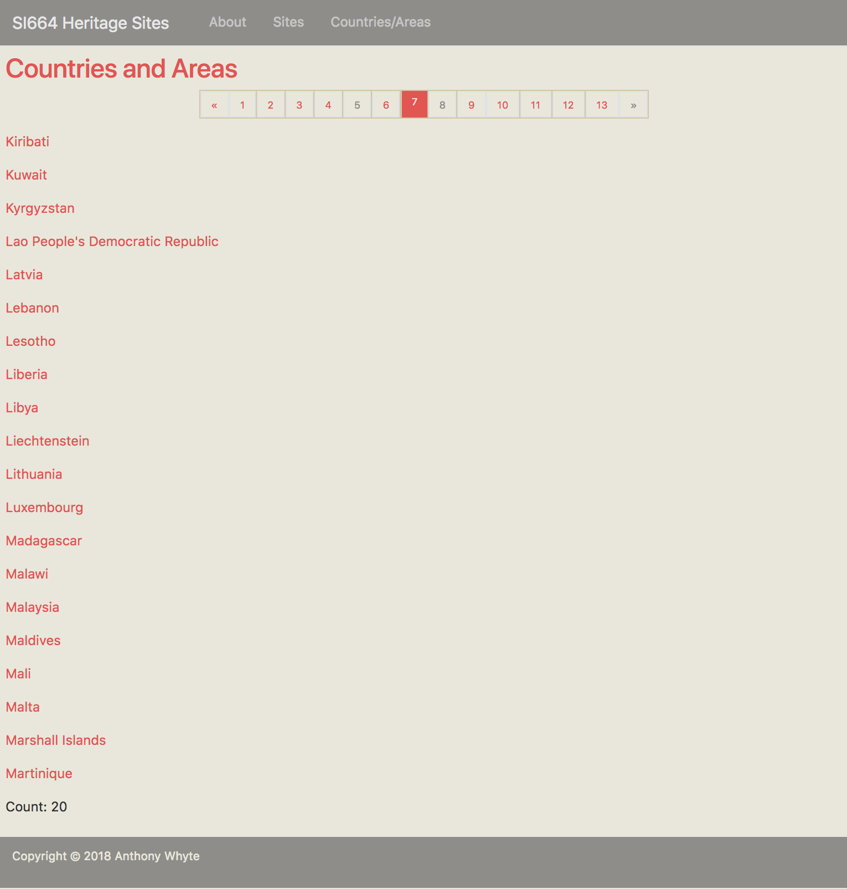
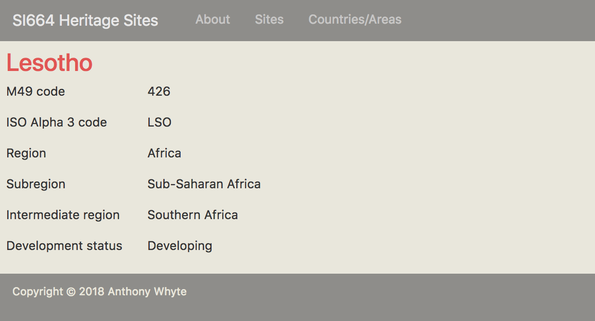

# SI 664 Midterm
## Fall 2018

## Table of contents

* 1.0 [Preliminaries](#preliminaries)
  * 1.1 [Open web](#open_web)
  * 1.2 [Problem format](#problem_format)
  * 1.3 [Create a temporary work folder](#work_folder)
  * 1.4 [Potential gotchas](#gotchas)
* 2.0 [SQL SELECT statement problems](#sql_problems)
  * 2.1 [Return list of Indian heritage sites inscribed from the year 2000 to the present](#q1)
  * 2.2 [Return sub-saharan heritage site counts grouped by intermediate region and site category](#q2)
  * 2.3 [Return list of heritage sites and counts by country / area (top 25)](#q3)
* 3.0 [Django ORM QuerySet problems](#queryset_problems)
  * 3.1 [Return non-European heritage sites with names containing the words "city" or "town"](#q4)
  * 3.2 [Return sub-saharan heritage site counts grouped by intermediate region and site category](#q5)
  * 3.3 [Return count of heritage sites in Africa, Asia & the Americas that are located between the Tropics of Cancer and Capricorn](#q6)
* 4.0 [Django heritagesites app](#app)
  * 4.1 [Add new pages, URLs, templates, and a navbar link](#app_pages)
* 5.0 [Submit your work to Canvas](#submit)

## <a name="preliminaries"></a>1.0 Preliminaries
You have three groups of problems to complete:

* SQL SELECT statements (220 pts)
  - Choose __two__ (2), *and only two*, of the three SQL problems provided to solve.
  - :warning: Do *not* submit more than __two__ SQL SELECT solutions for grading. If you submit all
   three SQL problem solutions I will toss out the highest scoring solution in favor of the two *lowest* 
   SQL problem solution scores that you earn.
* Django ORM QuerySets (220 pts)
  - Choose __two__ (2), *and only two*, of the three Django `QuerySet` problems provided to solve.
  - :warning: Do *not* submit more than __two__ Django `QuerySet` solutions for grading. If you 
  submit all three Django `QuerySet` problem solutions I will toss out the highest scoring solution 
  in favor of the two *lowest* Django `QuerySet` solution scores that you earn.
* Django heritagesites app (310 pts)
  - create __two__ new `heritagesites` app pages.

Total points = 750

### <a name="open_web"></a>1.1 Open web
This midterm is open web (i.e., open book). For example feel free to open browser tabs and load the following pages:

* [SI664: MySQL SELECT Statement Examples](https://github.com/UMSI-SI664-2018Fall/SI664-docs/blob/master/sql/mysql_select_examples.md)
* [SI664: Django ORM QuerySet Examples](https://github.com/UMSI-SI664-2018Fall/SI664-docs/blob/master/orm/django_orm.md)

as well as other pages such as:

* [Django QuerySet API reference](https://docs.djangoproject.com/en/2.1/ref/models/querysets/)
* [The Django template language](https://docs.djangoproject.com/en/2.1/ref/templates/language/)

### <a name="problem_format"></a>1.2 Problem format
Each SQL statement and Django ORM `QuerySet` problem describes the desired result set and also 
lists a minimal set of requirements associated with each problem. 

:warning: The SQL statement requirements tables list required columns but do not list what JOIN 
syntax may be required to produce the desired result set. This is a deliberate omission. You are responsible for converting the hints provided into working SQL. 

:warning: The Django ORM `QuerySet` requirements tables provide only partial field paths and 
English language equivalents for required operator symbols (e.g., AND = '&'). You are responsible for providing the complete field name paths as well as the appropriate operator symbols in the Python code you write.

:warning: Only minimal descriptions of the views, URLs, and templates required to complete 
[section 4.0](#app_pages) are provided. Make use of the existing `heritagesites` app code to help
 guide your work.

### <a name="work_folder"></a>1.3 Create a temporary work folder
Create a temporary "midterm" work folder on your machine (e.g., `si664-midterm/`). As you 
complete the problems described below place the files that document your work in the "midterm" 
folder. When you have completed minimum set of problems required, create an archive (.zip) of the 
file collection and upload the archive to Canvas as described in [section 5.0](#submit) below.

### <a name="gotchas"></a>1.4 Potential gotchas
:warning: If you use a text editor to draft your SQL statements before running 
the queries in the MySQL shell make sure you set the format to *plain text* in order to avoid 
runtime errors due to font-related issues involving quotation marks or other special characters.

```commandline
mysql> SELECT hs.site_name
    -> FROM heritage_site hs
    -> WHERE hs.site_name = “The Forth Bridge”;                <-- quotation marks are bad
ERROR 1064 (42000): You have an error in your SQL syntax; check the manual that corresponds to your MySQL server version for the right syntax to use near 'Forth Bridge”' at line 3
```

:warning: If you use MySQL Workbench's query pane to write and test your SQL statements before 
running them in the shell be sure to tell the Workbench what database to use:

```mysql
Use unesco_heritage_sites;

SELECT hs.site_name 
FROM heritage_site hs 
WHERE hs.site_name = 'The Forth Bridge';
```

:bulb: You may find it easier to write your Python `QuerySet` code by using a backslash (\) to indicate that a statement is to continued on the next line.  Consider inserting a backslash after each method as the following example illustrates:

```python
ca = CountryArea.objects\
... .select_related('location')\
... .values(name=F('location__intermediate_region__intermediate_region_name'))\
... .filter(name__isnull=False)\
... .order_by('name')
```

## <a name="sql_problems"></a>2.0 SQL SELECT statement problems

### <a name="q1"></a>2.1 Return list of Indian heritage sites inscribed from the year 2000 to the present
Write a SQL statement that returns a list of India's heritage sites inscribed from the year 2000 to the present (inclusive).

:bulb: "from the year 2000 to the present (inclusive)" = sites inscribed starting in the year 2000 and ending in the year 2018.

#### 2.1.1 SQL statement and result set requirements
The SQL statement you write MUST meet the requirements described below.  

| Requirement | Description |
| :---------- | :---------- |
| columns | `sub_region.sub_region_name`, `country_area.country_area_name`, `heritage_site.site_name`, `heritage_site_category.category_name`, `heritage_site.date_inscribed` (in this order) |
| column aliases | subregion, country / area, heritage site, category, date_inscribed |
| filter | Indian ('India') heritage sites inscribed from the year 2000 to the present (inclusive) |
| sort order | Year inscribed (descending), heritage site name |

#### 2.1.2 Document your work
Run the statement in the MySQL shell. Copy and paste the resulting shell output, including

* the SQL statement executed 
* the result set 
* and the trailing "number of rows in set" line

into a file named `<uniqname>-q1.txt`. Then add the file to your temporary "midterm" working folder.
 
---

### <a name="q2"></a>2.2 Return sub-saharan heritage site counts grouped by intermediate region and site category
Write a SQL statement that returns aggregate counts of the number of heritage sites located in the UNSD subregion Sub-Saharan Africa *grouped* by subregion, intermediate region and heritage site category (i.e., Cultural, Mixed, and Natural).

:bulb: this query requires use of `COUNT(DISTINCT ...)` in order to filter out duplicate heritage 
site rows resulting from the many-to-many relationship between the `heritage_site` and `country_area` tables.

#### 2.2.1 SQL statement and result set requirements
The SQL statement you write MUST meet the requirements described below.

| Requirement | Description |
| :---------- | :---------- |
| columns | `sub_region.sub_region_name`, `intermediate_region.intermediate_region_name`, `heritage_site_category.category_name`, `COUNT(DISTINCT heritage_site.heritage_site_id)` (in this order) |
| column aliases | subregion, intermediate region, category, heritage sites |
| filter | restrict intermediate regions to those located in the subregion 'Sub-Saharan Africa' only |
| sort order | intermediate region name (ascending), category name (ascending) |

#### 2.2.2 Document your work
Run the statement in the MySQL shell. Copy and paste the resulting shell output, including
                                                                                 
* the SQL statement executed 
* the result set 
* and the trailing "number of rows in set" line

into a file named `<uniqname>-q2.txt`. Then add the file to your temporary "midterm" working folder.
 
---

### <a name="q3"></a>2.3 Return list of heritage sites and counts by country / area (top 25) 
Critics have noted that a Eurocentric bias has previously existed in the choice of sites recognized by UNESCO as possessing ["outstanding universal value"](https://whc.unesco.org/en/criteria/). To begin to test this concern write a SQL statement that returns aggregated counts of heritage sites *grouped* by region, subregion, and country / area. Limit the result set to the top 25 countries / areas by heritage site count.  

#### 2.3.1 SQL statement and result set requirements
The SQL statement you write MUST meet the requirements described below. 

| Requirement | Description |
| :---------- | :---------- |
| columns | `region.region_name`, `sub_region.sub_region_name`, `country_area.country_area_name`, `COUNT(*)` (in this order) |
| column aliases | region, subregion, country / area, heritage sites |
| group by | required |
| sort order | heritage sites count (descending), region name (ascending), subregion name (ascending), country / area (ascending) |
| limit | top 25 countries / areas by aggregated heritage site count |

:bulb: the numbers returned will include, in certain cases, sites shared between one or more countries (which is ok in this case). 

#### 2.3.2 Document your work
Run the statement in the MySQL shell. Copy and paste the resulting shell output, including
                                                                                 
* the SQL statement executed 
* the result set 
* and the trailing "number of rows in set" line

into a file named `<uniqname>-q3.txt`. Then add the file to your temporary "midterm" working folder.

## <a name="queryset_problems"></a> 3.0 Django ORM QuerySet problems

### <a name="q4"></a>3.1 Return non-European heritage sites with names containing the words "city" or "town" 
Return a `QuerySet` of heritage sites located *outside* of Europe (i.e., region not Europe) that contain the words "City" or "Town" in the site name. The `filter()` that you apply MUST make use of `Q()` objects.  Order the `QuerySet` by heritage site name.

:warning: If you assign `Q()` objects to all your filter conditions beware of Python's [operator precedence](https://docs.python.org/3/reference/expressions.html#operator-precedence) when assigning conditionals to your `filter()`.  The following `filter()` expressions are *not* equivalent:

```commandline
.filter(Q(...) & Q(...) | Q(...))
```
vs
```commandline
.filter(Q(...) & (Q(...) | Q(...)))
```

#### 3.1.1 Queryset 
Construct a `QuerySet` per the requirements described below. 

:warning: The requirements table provides only partial field paths and the English equivalents 
for required operator symbols (e.g., AND = '&'). You are responsible for providing the complete 
field name paths as well as the appropriate operator symbols in the Python code you write.

| Requirement | Description |
| :---------- | :---------- |
| Model Manager | `HeritageSite.objects` |
| Other imports | `Q` |
| filter() | region name *not* 'Europe' *and* (site name *contains* 'City' *or* 'Town'); `Q()` expressions required |
| order_by() | site name (ascending) |

:bulb: the `QuerySet` returned may include sites shared between one or more countries (which is 
ok in this case). 

#### 3.1.2 Document your work
Construct the `QuerySet`and execute your Python code in the Django Python shell. Then do the 
following:

* Print a `count()` of the `QuerySet` items. 
* Loop over the `QuerySet` iterable and print each heritage site object name. 

Copy and paste your `QuerySet` Python code, the count and the list of site names into a file 
named `<uniqname>-q4.txt`. Then add the file to your temporary "midterm" working folder.
 
---
 
### <a name="q5"></a> 3.2 Return sub-saharan heritage site counts grouped by intermediate region and site category
Construct a `QuerySet` that matches the result set produced by the SQL statement you wrote for 
question 2.0 above. The `QuerySet` is to be composed of dictionaries that provide aggregate 
counts of the number of heritage sites located in the UNSD subregion Sub-Saharan Africa *grouped* by subregion, intermediate region and heritage site category (i.e., Cultural, Mixed, and Natural).

#### 3.2.1 Queryset
Construct a `QuerySet` per the requirements described below. 

:bulb: this query requires setting the `distinct=True` flag when annotating with `Count` in order to
 filter out duplicate heritage site rows resulting from the many-to-many relationship between the `heritage_site` and `country_area` tables.

| Requirement | Description |
| :---------- | :---------- |
| Model Manager | `HeritageSite.objects` |
| Other imports | `Count`, `F` |
| select_related() | optimize `QuerySet` construction by referencing the `HeritageSite` model field of type `models.ForeignKey()` | 
| values() | `sub_region__sub_region_name`, `intermediate_region__intermediate_region_name`, `heritage_site_category__category_name`);  use `F()` objects to alias these fields |
| filter() | restrict intermediate regions to those located in the subregion 'Sub-Saharan Africa' only  |
| annotate() | use this argument: `count=Count('heritage_site_id', distinct=True)` |
| order_by() | intermediate region name (ascending), category name (ascending) |

#### 3.2.2 Example dictionary item
```commandline
{'sub_region_name': 'Sub-Saharan Africa', 'intermediate_region_name': 'Eastern Africa', 'category_name': 'Cultural', 'count': <some number>}
. . .
```

#### 3.2.3 Document your work
Construct the `QuerySet`and execute your Python code in the Django Python shell. Then do the 
following: 

* Print a `count()` of the `QuerySet` items. 
* Loop over the `QuerySet` iterable and print each dictionary. 

Copy and paste your `QuerySet` Python code, the count and the list of dictionary items into a file named `<uniqname>-q5.txt`. Then add the file to your temporary "midterm" working folder.

---

### <a name="q6"></a>3.3 Return count of heritage sites in Africa, Asia & the Americas that are located between the Tropics of Cancer and Capricorn
The Tropic of Cancer (23.43685° latitude) is the most northerly circle of latitude on Earth at which the sun can be directly overhead.  It's southern equivalent is the Tropic of Capricorn (-23.43685° latitude). Create a `QuerySet` that returns a *distinct* summary count of the number of African and Asian heritage sites that are located within this zone.

#### 3.3.1 Queryset
Construct a `QuerySet` per the requirements described below. 

:bulb: this query requires setting the `distinct=True` flag when aggregating with `Count` in 
order to filter out duplicate heritage site rows resulting from the many-to-many relationship between the `heritage_site` and `country_area` tables.

:warning: If you assign `Q()` objects to all your filter conditions beware of Python's [operator precedence](https://docs.python.org/3/reference/expressions.html#operator-precedence) when assigning conditionals to your `filter()`.  The following `filter()` expressions are *not* equivalent:  

```commandline
.filter(Q(...) & Q(...) | Q(...) | Q(...))
```
vs
```commandline
.filter(Q(...) & (Q(...) | Q(...) | Q(...)))
```

| Requirement | Description |
| :---------- | :---------- |
| Model Manager | `HeritageSite.objects` |
| Other imports | `Count`, `Q` | 
| filter() | heritage sites located in the regions 'Africa', 'Asia', *or* the 'Americas' *and* with a latitude between -23.43685 and 23.43685 (use [range](https://docs.djangoproject.com/en/2.1/ref/models/querysets/#range])) |
| aggregate() | use this argument: `count=Count('heritage_site_id', distinct=True)` |

#### 3.3.2 Document your work
Construct the `QuerySet`and execute your Python code in the Django Python shell. Then do the following: 

* Print the dictionary (e.g., print(variable)) returned after the `QuerySet` is evaluated.

Copy and paste your `QuerySet` Python code and the dictionary returned that contains the count into a 
file named `<uniqname>-q6.txt`. Then add the file to your temporary "midterm" working folder.

## <a name="app"></a>4.0 Django heritagesites app
Start up the Django development server and create a page that provides a paginated list of 
UNSD countries and areas.



The list page will link to a detail page that provides regional and other information relevant to
 each country / area in the list.
 


### <a name="app_pages"></a>4.1 Add new pages, URLs, templates, and a navbar link

#### 4.1.1 Add new views
Create two new class views to `heritagesites/views.py`:

##### CountryAreaListView(generic.ListView)
| View | Description/value(s) |
| :---------- | :---------- |
| import | `CountryArea` |
| class | `CountryAreaListView(generic.ListView)` |
| `model` | `CountryArea` |
| `context_object_name` | `countries` |
| `template_name` | `country_area.html` |
| `paginate_by` | 20 items per page |
| `def get_queryset(self)` method | return a `CountryArea.objects` `QuerySet`; optimize `QuerySet` creation by calling `.select_related(*fields)` lookup referencing all `CountryArea` model fields of type `models.ForeignKey()`; call `.order_by(*fields)` sorting on `country_area_name` (ascending) |
 
##### CountryAreaDetailView(generic.DetailView)
| View | Description/value(s) |
| :---------- | :---------- |
| import | `CountryArea` |
| class | `CountryAreaDetailView(generic.DetailView)` |
| `model` | `CountryArea` |
| `context_object_name` | `country` |
| `template_name` | `country_area_detail.html` |

:bulb: Review other view classes in `views.py` to ensure that you have designed your new view 
classes correctly, including setting the property values appropriately (e.g., correct paths to template files).

#### 4.1.2 Add new URL routes
Add two new `path(route, view, kwargs=None, name=None)` items to the `urlpatterns` list in to 
`heritagesites/urls.py`. Mimic the URLs created for the `site.html` and `site_detail.html` pages, setting the following attributes:
 
 * route
 * view
 * name

```python
urlpatterns = [
    path('', views.HomePageView.as_view(), name='home'),
    path('about/', views.AboutPageView.as_view(), name='about'),
    
    path('someroutes/', views.SomeClass.as_view(), name='some_name'),
    path('someroutes/.../', views.SomeOtherClass.as_view(), name='some_other_name'),
    
    path('sites/', views.SiteListView.as_view(), name='site'),
    path('sites/<int:pk>/', views.SiteDetailView.as_view(), name='site_detail'),
]
```

#### 4.1.3 Add new templates
Create two new templates in the `heritagesites/templates/heritagesites/` directory.  The template
 names *must* match the names referenced in the class views:

##### country_area.html
| Template | Description |
| :---------- | :---------- |
| name | `country_area.html` |
| extends | `base.html` |
| pagination | Copy and paste in `<nav>` pagination code `<nav>` from `site.html` |
| fields to display | Loop over the `QuerySet` returned by `CountryAreaListView(generic.ListView)` and render an `<a>` tag with an `href` attribute value set to a url template tag that provides the correct URL reference to the country / area to be displayed in `country_area_detail.html`. Render the `country_area_name` prior to closing (`</a>`) the anchor tag. Again, utilize `site.html` as a guide. |
| format | Model the page on `site.html` with respect to placement of the pagination code, choice of HTML tags, etc. |

##### country_area_detail.html
| Template | Description |
| :---------- | :---------- |
| name | `country_area_detail.html` |
| extends | `base.html` |
| pagination | none |
| fields to display | `country_area_name`, `m49_code`, `iso_alpha3_code`, `region.region_name`, `sub_region.sub_region_name`, `intermediate_region.intermediate_region_name`, `dev_status.dev_status_name` |
| format | Model the page on `site_detail.html`, particularly as regards use of `<div>` tags, etc. |

:bulb: recall that only a small number of countries / areas are located in an UNSD intermediate 
region. Rather than render a row with no value to be displayed in such cases wrap the row in 
` ... ` conditional tags as is illustrated in `site_detail.html`.

```html

  <div class="row">
    <div class="col-sm-2">
      <p>Justification</p>
    </div>
    <div class="col-sm-10">
      {{ site.justification | safe }}
    </div>
  </div>

```

#### 4.1.4 Add a Navbar link
In `base.html` add a new navigation link item:

```html
  <ul class="navbar-nav">
  
    <!-- Add a new link item -->
    
    <li class="nav-item">
      <a class="nav-link" href="">Countries/Areas</a>
    </li>
  </ul>
```
#### 4.1.5 Document your work
Make copies of the following files and place them in your "midterm" temporary work folder: 

* `views.py`
* `urls.py`
* `country_area.html`
* `country_area_detail.html`
 
Prefix each of the file copies with your `uniqname`:

* `<uniqname>-views.py`
* `<uniqname>-urls.py`
* `<uniqname>-country_area.html`
* `<uniqname>-country_area_detail.html`

Then take two screenshots of your running `heritagesites` app:

* Countries/Areas list (pg 7): http://localhost:8000/heritagesites/countries/?page=7
* Lesotho detail: http://localhost:8000/heritagesites/countries/127/

Rename the files as follows and copy them to your "midterm" temporary work folder:

* `<uniqname>-country_area_pg_7.png`
* `<uniqname>-lesotho.png` 

## <a name="submit"></a>5.0 Submit your work
When you have completed the minimum number of problems described above and placed copies of your work files in your temporary "midterm" work folder, create an archive (.zip) of file collection named 

`<uniqname>-si664_midterm-20181023.zip`. 

Upload the archive to [Canvas](https://umich.instructure.com/courses/245664/assignments/566337).

As a reminder:

:warning: Do *not* submit more than __two__ SQL SELECT solutions for grading. If you submit all 
three SQL problem solutions I will toss out the highest scoring solution in favor of the two *lowest* SQL problem solution scores that you earn.

:warning: Do *not* submit more than __two__ Django `QuerySet` solutions for grading. If you submit all three Django `QuerySet` problem solutions I will toss out the highest scoring solution in favor of the two *lowest* Django `QuerySet` solution scores that you earn.

```commandline
si664-midterm/
     <uniqname>-si664_midterm-2018fall.zip
        [contents]
           [SQL SELECT two of]
              <uniqname>-q1.txt
              <uniqname>-q2.txt
              <uniqname>-q3.txt
           [Django ORM two of]   
              <uniqname>-q4.txt
              <uniqname>-q5.txt
              <uniqname>-q6.txt
           <uniqname>-views.py
           <uniqname>-urls.py
           <uniqname>-country_area.html
           <uniqname>-country_area_detail.html
           <uniqname>-country_area_pg_7.png
           <uniqname>-lesotho.png 
```

---