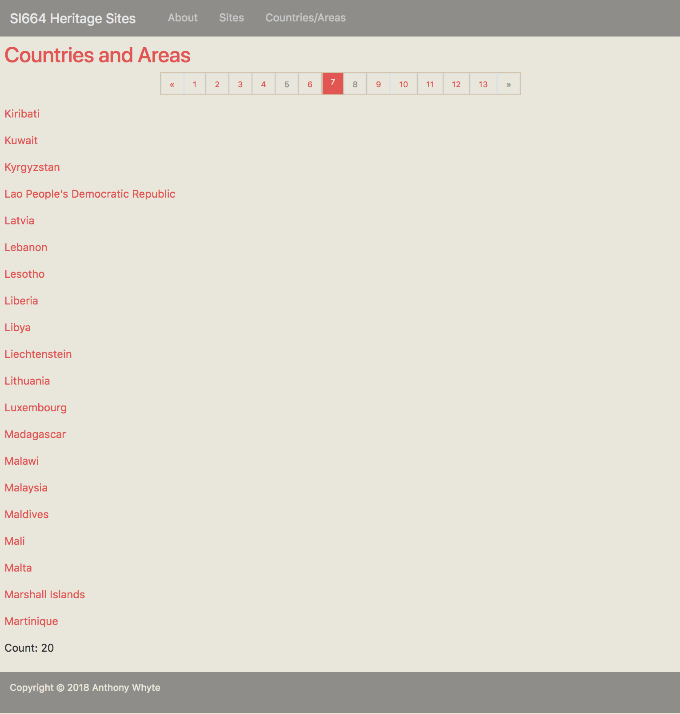

# SI 664 Midterm (Answers)
## Fall 2018

## Table of contents

* 2.0 [SQL SELECT statement problems](#sql_problems)
  * 2.1 [Return list of Indian heritage sites inscribed from the year 2000 to the present](#q1)
  * 2.2 [Return sub-saharan heritage site counts grouped by intermediate region and site category](#q2)
  * 2.3 [Return list of heritage sites and counts by country / area (top 25)](#q3)
* 3.0 [Django ORM QuerySet problems](#queryset_problems)
  * 3.1 [Return non-European heritage sites with names containing the words "city" or "town"](#q4)
  * 3.2 [Return sub-saharan heritage site counts grouped by intermediate region and site category](#q5)
  * 3.3 [Return count of heritage sites in Africa, Asia & the Americas that are located between the Tropics of Cancer and Capricorn](#q6)
* 4.0 [Django heritagesites app](#app)
  * 4.1 [Add new pages, URLs, templates, and a navbar link](#app_pages)
* 5.0 [Submit your work to Canvas](#submit)

## <a name="sql_problems"></a>2.0 SQL SELECT statement problems

### <a name="q1"></a>2.1 Return list of Indian heritage sites inscribed from the year 2000 to the present
Write a SQL statement that returns a list of India's heritage sites inscribed from the year 2000 to the present (inclusive).

#### 2.1.1 SQL statement and result set requirements
The SQL statement you write MUST meet the requirements described below.  

| Requirement | Description |
| :---------- | :---------- |
| columns | `sub_region.sub_region_name`, `country_area.country_area_name`, `heritage_site.site_name`, `heritage_site_category.category_name`, `heritage_site.date_inscribed` (in this order) |
| column aliases | subregion, country / area, heritage site, category, date_inscribed |
| filter | Indian ('India') heritage sites inscribed from the year 2000 to the present (inclusive) |
| sort order | Year inscribed (descending), heritage site name |

#### 2.1.2 Correct response

```mysql
SELECT sr.sub_region_name AS `subregion`, ca.country_area_name AS `country / area`, 
       hs.site_name AS `heritage site`, hsc.category_name AS `category`, hs.date_inscribed AS `date_inscribed`
  FROM heritage_site hs
       INNER JOIN heritage_site_jurisdiction hsj 
               ON hs.heritage_site_id = hsj.heritage_site_id
       INNER JOIN country_area ca 
               ON hsj.country_area_id = ca.country_area_id
       INNER JOIN location l
               ON ca.location_id = l.location_id
       INNER JOIN sub_region sr
               ON l.sub_region_id = sr.sub_region_id
       INNER JOIN heritage_site_category hsc
               ON hs.heritage_site_category_id = hsc.category_id
 WHERE TRIM(ca.country_area_name) = 'India' AND hs.date_inscribed >= 2000
 ORDER BY hs.date_inscribed DESC, hs.site_name;
```

OR

```mysql
SELECT sr.sub_region_name AS `subregion`, ca.country_area_name AS `country / area`, 
       hs.site_name AS `heritage site`, hsc.category_name AS `category`, hs.date_inscribed AS `date_inscribed`
  FROM heritage_site hs
       LEFT JOIN heritage_site_jurisdiction hsj 
              ON hs.heritage_site_id = hsj.heritage_site_id
       LEFT JOIN country_area ca 
              ON hsj.country_area_id = ca.country_area_id
       LEFT JOIN location l
              ON ca.location_id = l.location_id
       LEFT JOIN sub_region sr
              ON l.sub_region_id = sr.sub_region_id
       LEFT JOIN heritage_site_category hsc
              ON hs.heritage_site_category_id = hsc.category_id
 WHERE TRIM(ca.country_area_name) = 'India' AND hs.date_inscribed >= 2000
 ORDER BY hs.date_inscribed DESC, hs.site_name;
```

This `WHERE` clause is also acceptable:

```mysql
WHERE TRIM(ca.country_area_name) = 'India' AND hs.date_inscribed BETWEEN 2000 and 2018
```

```commandline
+---------------+----------------+--------------------------------------------------------------------------------------------+----------+----------------+
| subregion     | country / area | heritage site                                                                              | category | date_inscribed |
+---------------+----------------+--------------------------------------------------------------------------------------------+----------+----------------+
| Southern Asia | India          | Victorian Gothic and Art Deco Ensembles of Mumbai                                          | Cultural |           2018 |
| Southern Asia | India          | Historic City of Ahmadabad                                                                 | Cultural |           2017 |
| Southern Asia | India          | Archaeological Site of Nalanda <i>Mahavihara</i> at Nalanda, Bihar                         | Cultural |           2016 |
| Southern Asia | India          | Khangchendzonga National Park                                                              | Mixed    |           2016 |
| Southern Asia | India          | The Architectural Work of Le Corbusier, an Outstanding Contribution to the Modern Movement | Cultural |           2016 |
| Southern Asia | India          | Great Himalayan National Park Conservation Area                                            | Natural  |           2014 |
| Southern Asia | India          | Rani-ki-Vav (the Queen’s Stepwell) at Patan, Gujarat                                       | Cultural |           2014 |
| Southern Asia | India          | Hill Forts of Rajasthan                                                                    | Cultural |           2013 |
| Southern Asia | India          | Western Ghats                                                                              | Natural  |           2012 |
| Southern Asia | India          | The Jantar Mantar, Jaipur                                                                  | Cultural |           2010 |
| Southern Asia | India          | Red Fort Complex                                                                           | Cultural |           2007 |
| Southern Asia | India          | Champaner-Pavagadh Archaeological Park                                                     | Cultural |           2004 |
| Southern Asia | India          | Chhatrapati Shivaji Terminus (formerly Victoria Terminus)                                  | Cultural |           2004 |
| Southern Asia | India          | Rock Shelters of Bhimbetka                                                                 | Cultural |           2003 |
| Southern Asia | India          | Mahabodhi Temple Complex at Bodh Gaya                                                      | Cultural |           2002 |
+---------------+----------------+--------------------------------------------------------------------------------------------+----------+----------------+
15 rows in set (0.00 sec)
```

---

### <a name="q2"></a>2.2 Return sub-saharan heritage site counts grouped by intermediate region and site category
Write a SQL statement that returns aggregate counts of the number of heritage sites located in the UNSD subregion Sub-Saharan Africa *grouped* by subregion, intermediate region and heritage site category (i.e., Cultural, Mixed, and Natural).

:bulb: this query requires use of `COUNT(DISTINCT ...)` in order to filter out duplicate heritage 
site rows resulting from the many-to-many relationship between the `heritage_site` and `country_area` tables.

#### 2.2.1 SQL statement and result set requirements
The SQL statement you write MUST meet the requirements described below.

| Requirement | Description |
| :---------- | :---------- |
| columns | `sub_region.sub_region_name`, `intermediate_region.intermediate_region_name`, `heritage_site_category.category_name`, `COUNT(DISTINCT heritage_site.heritage_site_id)` (in this order) |
| column aliases | subregion, intermediate region, category, heritage sites |
| filter | restrict intermediate regions to those located in the subregion 'Sub-Saharan Africa' only |
| sort order | intermediate region name (ascending), category name (ascending) |

#### 2.2.2 Correct response

```mysql
SELECT sr.sub_region_name AS `subregion`, ir.intermediate_region_name AS `intermediate region`,  
   hsc.category_name AS `category`, COUNT(DISTINCT hs.heritage_site_id) AS `heritage sites`
   FROM heritage_site hs
        INNER JOIN heritage_site_jurisdiction hsj
                ON hs.heritage_site_id = hsj.heritage_site_id
        INNER JOIN country_area ca
                ON hsj.country_area_id = ca.country_area_id
        INNER JOIN location l
                ON ca.location_id = l.location_id
        INNER JOIN sub_region sr
                ON l.sub_region_id = sr.sub_region_id
        INNER JOIN intermediate_region ir
                ON l.intermediate_region_id = ir.intermediate_region_id
        INNER JOIN heritage_site_category hsc
                ON hs.heritage_site_category_id = hsc.category_id
 WHERE TRIM(sr.sub_region_name) = 'Sub-Saharan Africa'
 GROUP BY sr.sub_region_name, ir.intermediate_region_name, hsc.category_name
 ORDER BY sr.sub_region_name, ir.intermediate_region_name, hsc.category_name;
```

OR

```mysql
SELECT sr.sub_region_name AS `subregion`, ir.intermediate_region_name AS `intermediate region`,  
   hsc.category_name AS `category`, COUNT(DISTINCT hs.heritage_site_id) AS `heritage sites`
   FROM heritage_site hs
         LEFT JOIN heritage_site_jurisdiction hsj
                ON hs.heritage_site_id = hsj.heritage_site_id
         LEFT JOIN country_area ca
                ON hsj.country_area_id = ca.country_area_id
         LEFT JOIN location l
                ON ca.location_id = l.location_id
         LEFT JOIN sub_region sr
                ON l.sub_region_id = sr.sub_region_id
         LEFT JOIN intermediate_region ir
                ON l.intermediate_region_id = ir.intermediate_region_id
         LEFT JOIN heritage_site_category hsc
                ON hs.heritage_site_category_id = hsc.category_id
 WHERE TRIM(sr.sub_region_name) = 'Sub-Saharan Africa'
 GROUP BY sr.sub_region_name, ir.intermediate_region_name, hsc.category_name
 ORDER BY sr.sub_region_name, ir.intermediate_region_name, hsc.category_name;
```

```commandline
+--------------------+---------------------+----------+----------------+
| subregion          | intermediate region | category | heritage sites |
+--------------------+---------------------+----------+----------------+
| Sub-Saharan Africa | Eastern Africa      | Cultural |             25 |
| Sub-Saharan Africa | Eastern Africa      | Mixed    |              1 |
| Sub-Saharan Africa | Eastern Africa      | Natural  |             16 |
| Sub-Saharan Africa | Middle Africa       | Cultural |              1 |
| Sub-Saharan Africa | Middle Africa       | Mixed    |              2 |
| Sub-Saharan Africa | Middle Africa       | Natural  |              9 |
| Sub-Saharan Africa | Southern Africa     | Cultural |              7 |
| Sub-Saharan Africa | Southern Africa     | Mixed    |              1 |
| Sub-Saharan Africa | Southern Africa     | Natural  |              6 |
| Sub-Saharan Africa | Western Africa      | Cultural |             20 |
| Sub-Saharan Africa | Western Africa      | Mixed    |              1 |
| Sub-Saharan Africa | Western Africa      | Natural  |              8 |
+--------------------+---------------------+----------+----------------+
12 rows in set (0.00 sec)
```
 
---

### <a name="q3"></a>2.3 Return list of heritage sites and counts by country / area (top 25) 
Critics have noted that a Eurocentric bias has previously existed in the choice of sites recognized by UNESCO as possessing ["outstanding universal value"](https://whc.unesco.org/en/criteria/). To begin to test this concern write a SQL statement that returns aggregated counts of heritage sites *grouped* by region, subregion, and country / area. Limit the result set to the top 25 countries / areas by heritage site count.  

#### 2.3.1 SQL statement and result set requirements
The SQL statement you write MUST meet the requirements described below. 

| Requirement | Description |
| :---------- | :---------- |
| columns | `region.region_name`, `sub_region.sub_region_name`, `country_area.country_area_name`, `COUNT(*)` (in this order) |
| column aliases | region, subregion, country / area, heritage sites |
| group by | required |
| sort order | heritage sites count (descending), region name (ascending), subregion name (ascending), country / area (ascending) |
| limit | top 25 countries / areas by aggregated heritage site count |

#### 2.3.2 Correct response

```mysql
SELECT r.region_name AS `region`, sr.sub_region_name AS `subregion`, 
       ca.country_area_name AS `country / area`, COUNT(*) AS `heritage sites`
  FROM heritage_site hs
       INNER JOIN heritage_site_jurisdiction hsj 
               ON hs.heritage_site_id = hsj.heritage_site_id
       INNER JOIN country_area ca 
               ON hsj.country_area_id = ca.country_area_id
       INNER JOIN location l
               ON ca.location_id = l.location_id
       INNER JOIN region r
               ON l.region_id = r.region_id
       INNER JOIN sub_region sr 
               ON l.sub_region_id = sr.sub_region_id
GROUP BY r.region_name, sr.sub_region_name,  ca.country_area_name
ORDER BY COUNT(*) DESC, r.region_name, sr.sub_region_name,  ca.country_area_name LIMIT 25;
```

OR

```mysql
SELECT r.region_name AS `region`, sr.sub_region_name AS `subregion`, 
       ca.country_area_name AS `country / area`, COUNT(*) AS `heritage sites`
  FROM heritage_site hs
       LEFT JOIN heritage_site_jurisdiction hsj 
              ON hs.heritage_site_id = hsj.heritage_site_id
       LEFT JOIN country_area ca 
              ON hsj.country_area_id = ca.country_area_id
       LEFT JOIN location l
              ON ca.location_id = l.location_id
       LEFT JOIN region r
              ON l.region_id = r.region_id
       LEFT JOIN sub_region sr 
              ON l.sub_region_id = sr.sub_region_id
GROUP BY r.region_name, sr.sub_region_name,  ca.country_area_name
ORDER BY COUNT(*) DESC, r.region_name, sr.sub_region_name,  ca.country_area_name LIMIT 25;
```

```commandline
+----------+---------------------------------+------------------------------------------------------+----------------+
| region   | subregion                       | country / area                                       | heritage sites |
+----------+---------------------------------+------------------------------------------------------+----------------+
| Europe   | Southern Europe                 | Italy                                                |             54 |
| Asia     | Eastern Asia                    | China                                                |             53 |
| Europe   | Southern Europe                 | Spain                                                |             47 |
| Europe   | Western Europe                  | France                                               |             44 |
| Europe   | Western Europe                  | Germany                                              |             44 |
| Asia     | Southern Asia                   | India                                                |             37 |
| Americas | Latin America and the Caribbean | Mexico                                               |             35 |
| Europe   | Northern Europe                 | United Kingdom of Great Britain and Northern Ireland |             31 |
| Europe   | Eastern Europe                  | Russian Federation                                   |             28 |
| Americas | Northern America                | United States of America                             |             23 |
| Asia     | Southern Asia                   | Iran (Islamic Republic of)                           |             23 |
| Asia     | Eastern Asia                    | Japan                                                |             22 |
| Americas | Latin America and the Caribbean | Brazil                                               |             21 |
| Americas | Northern America                | Canada                                               |             19 |
| Oceania  | Australia and New Zealand       | Australia                                            |             19 |
| Asia     | Western Asia                    | Turkey                                               |             18 |
| Europe   | Southern Europe                 | Greece                                               |             18 |
| Europe   | Eastern Europe                  | Poland                                               |             15 |
| Europe   | Northern Europe                 | Sweden                                               |             15 |
| Europe   | Southern Europe                 | Portugal                                             |             15 |
| Asia     | Eastern Asia                    | Republic of Korea                                    |             13 |
| Europe   | Western Europe                  | Belgium                                              |             13 |
| Americas | Latin America and the Caribbean | Peru                                                 |             12 |
| Europe   | Eastern Europe                  | Czechia                                              |             12 |
| Europe   | Western Europe                  | Switzerland                                          |             12 |
+----------+---------------------------------+------------------------------------------------------+----------------+
25 rows in set (0.01 sec)
```

## <a name="queryset_problems"></a> 3.0 Django ORM QuerySet problems

### <a name="q4"></a>3.1 Return non-European heritage sites with names containing the words "city" or "town" 
Return a `QuerySet` of heritage sites located *outside* of Europe (i.e., region not Europe) that contain the words "City" or "Town" in the site name. The `filter()` that you apply MUST make use of `Q()` objects. Order the `QuerySet` by heritage site name.

#### 3.1.1 Queryset 
Construct a `QuerySet` per the requirements described below. 

:warning: The requirements table provides only partial field paths and the English equivalents 
for required operator symbols (e.g., AND = '&'). You are responsible for providing the complete 
field name paths as well as the appropriate operator symbols in the Python code you write.

| Requirement | Description |
| :---------- | :---------- |
| Model Manager | `HeritageSite.objects` |
| Other imports | `Q` |
| filter() | region name *not* 'Europe' *and* (site name *contains* 'City' *or* 'Town'); `Q()` expressions required |
| order_by() | site name (ascending) |

:bulb: the `QuerySet` returned may include sites shared between one or more countries (which is 
ok in this case). 

#### 3.1.2 Correct response

```python
from heritagesites.models import HeritageSite
from django.db.models import Q

hs = HeritageSite.objects\
        .select_related('heritage_site_category')\
        .filter(~Q(country_area__location__region__region_id = 4) &\
        (Q(site_name__contains = 'City') | Q(site_name__contains = 'Town')))\
        .order_by('site_name')
```

```commandline

>>> from heritagesites.models import HeritageSite
>>> from django.db.models import Q
>>> hs = HeritageSite.objects\
... .select_related('heritage_site_category')\
... .filter(~Q(country_area__location__region__region_id = 4) & (Q(site_name__contains = 'City') | Q(site_name__contains = 'Town')))\
... .order_by('site_name')
>>> hs.count()
70
>>> for h in hs:
...     site_name = h.site_name
...     for ca in h.country_area.all():
...         country_area_name = ca.country_area_name
...     site = ''.join([site_name, ' ', country_area_name, '\n'])
...     print(site)
...
Ancient City of Aleppo Syrian Arab Republic
Ancient City of Bosra Syrian Arab Republic
Ancient City of Damascus Syrian Arab Republic
Ancient City of Ping Yao China
Ancient City of Polonnaruwa Sri Lanka
Ancient City of Qalhat Oman
Ancient City of Sigiriya Sri Lanka
Ancient Maya City and Protected Tropical Forests of Calakmul, Campeche Mexico
Asmara: A Modernist African City Eritrea
Buddhist Ruins of Takht-i-Bahi and Neighbouring City Remains at Sahr-i-Bahlol Pakistan
Central University City Campus of the <i>Universidad Nacional Autónoma de México</i> (UNAM) Mexico
City of Cuzco Peru
City of Potosí Bolivia (Plurinational State of)
City of Quito Ecuador
City of Safranbolu Turkey
Colonial City of Santo Domingo Dominican Republic
El Tajin, Pre-Hispanic City Mexico
Harar Jugol, the Fortified Historic Town Ethiopia
Hebron/Al-Khalil Old Town State of Palestine
Historic Centre of Mexico City and Xochimilco Mexico
Historic Centre of the Town of Diamantina Brazil
Historic Centre of the Town of Goiás Brazil
Historic Centre of the Town of Olinda Brazil
Historic City of Ahmadabad India
Historic City of Ayutthaya Thailand
Historic City of Meknes Morocco
Historic City of Sucre Bolivia (Plurinational State of)
Historic City of Vigan Philippines
Historic City of Yazd Iran (Islamic Republic of)
Historic Fortified Town of Campeche Mexico
Historic Inner City of Paramaribo Suriname
Historic Mosque City of Bagerhat Bangladesh
Historic Quarter of the City of Colonia del Sacramento Uruguay
Historic Quarter of the Seaport City of Valparaíso Chile
Historic Town of Grand-Bassam Côte d'Ivoire
Historic Town of Guanajuato and Adjacent Mines Mexico
Historic Town of Ouro Preto Brazil
Historic Town of Sukhothai and Associated Historic Towns Thailand
Historic Town of Zabid Yemen
Historical Centre of the City of Arequipa Peru
Hoi An Ancient Town Viet Nam
Lamu Old Town Kenya
Levuka Historical Port Town Fiji
Melaka and George Town, Historic Cities of the Straits of Malacca Malaysia
Old City of Acre Israel
Old City of Jerusalem and its Walls Israel
Old City of Sana'a Yemen
Old Town Lunenburg Canada
Old Town of Galle and its Fortifications Sri Lanka
Old Town of Ghadamès Libya
Old Town of Lijiang China
Old Towns of Djenné Mali
Old Walled City of Shibam Yemen
Portuguese City of Mazagan (El Jadida) Morocco
Pre-Hispanic City and National Park of Palenque Mexico
Pre-Hispanic City of Chichen-Itza Mexico
Pre-Hispanic City of Teotihuacan Mexico
Pre-Hispanic Town of Uxmal Mexico
Punic Town of Kerkuane and its Necropolis Tunisia
Rabat, Modern Capital and Historic City: a Shared Heritage Morocco
Sacred City of Anuradhapura Sri Lanka
Sacred City of Caral-Supe Peru
Sacred City of Kandy Sri Lanka
Samarra Archaeological City Iraq
São Francisco Square in the Town of São Cristóvão Brazil
Sewell Mining Town Chile
Stone Town of Zanzibar United Republic of Tanzania
Town of Luang Prabang Lao People's Democratic Republic
Walled City of Baku with the Shirvanshah's Palace and Maiden Tower Azerbaijan
White City of Tel-Aviv – the Modern Movement Israel
```

ALSO ACCEPTED

```python
from heritagesites.models import HeritageSite
from django.db.models import Q
hs = HeritageSite.objects\
        .values('site_name', region_name = F('country_area__location__region__region_name'))\
        .filter(~Q(country_area__location__region__region_name='Europe') &\
        (Q(site_name__contains = 'city') | Q(site_name__contains = 'town') |\
        Q(site_name__contains = 'City') | Q(site_name__contains = 'Town')))\
        .order_by('site_name')
```

```commandline
>>> from heritagesites.models import HeritageSite
>>> from django.db.models import Q
>>> hs = HeritageSite.objects\
... .values('site_name', region_name = F('country_area__location__region__region_name'))\
... .filter(~Q(country_area__location__region__region_name='Europe') &\
...  (Q(site_name__contains = 'city') | Q(site_name__contains = 'town') |\
...  Q(site_name__contains = 'City') | Q(site_name__contains = 'Town')))\
... .order_by('site_name')
>>> print(hs.count())
72
```

Adds two more sites to the list:

* Historic Bridgetown and its Garrison
* Protective town of San Miguel and the Sanctuary of Jesús Nazareno de Atotonilco

---
 
### <a name="q5"></a> 3.2 Return sub-saharan heritage site counts grouped by intermediate region and site category
Construct a `QuerySet` that matches the result set produced by the SQL statement you wrote for 
question 2.0 above. The `QuerySet` is to be composed of dictionaries that provide aggregate 
counts of the number of heritage sites located in the UNSD subregion Sub-Saharan Africa *grouped* by subregion, intermediate region and heritage site category (i.e., Cultural, Mixed, and Natural).

#### 3.2.1 Queryset
Construct a `QuerySet` per the requirements described below. 

:bulb: this query requires setting the `distinct=True` flag when annotating with `Count` in order to
 filter out duplicate heritage site rows resulting from the many-to-many relationship between the `heritage_site` and `country_area` tables.

| Requirement | Description |
| :---------- | :---------- |
| Model Manager | `HeritageSite.objects` |
| Other imports | `Count`, `F` |
| select_related() | optimize `QuerySet` construction by referencing the `HeritageSite` model field of type `models.ForeignKey()` | 
| values() | `sub_region__sub_region_name`, `intermediate_region__intermediate_region_name`, `heritage_site_category__category_name`);  use `F()` objects to alias these fields |
| filter() | restrict intermediate regions to those located in the subregion 'Sub-Saharan Africa' only  |
| annotate() | use this argument: `count=Count('heritage_site_id', distinct=True)` |
| order_by() | intermediate region name (ascending), category name (ascending) |


#### 3.2.2 Correct response

```python
from heritagesites.models import HeritageSite
from django.db.models import Count, F
hs = HeritageSite.objects\
         .select_related('heritage_site_category')\
         .values(sub_region_name=F('country_area__location__sub_region__sub_region_name'), intermediate_region_name=F('country_area__location__intermediate_region__intermediate_region_name'), category_name=F('heritage_site_category__category_name'))\
         .filter(country_area__location__sub_region__sub_region_name = 'Sub-Saharan Africa')\
         .annotate(count=Count('heritage_site_id', distinct=True))\
         .order_by('intermediate_region_name', 'category_name')
```

```commandline
>>> from heritagesites.models import HeritageSite
>>> from django.db.models import Count, F
>>> hs = HeritageSite.objects\
... .select_related('heritage_site_category')\
... .values(sub_region_name=F('country_area__location__sub_region__sub_region_name'), intermediate_region_name=F('country_area__location__intermediate_region__intermediate_region_name'), category_name=F('heritage_site_category__category_name'))\
... .filter(country_area__location__sub_region__sub_region_name = 'Sub-Saharan Africa')\
... .annotate(count=Count('heritage_site_id', distinct=True))\
... .order_by('intermediate_region_name', 'category_name')
>>> hs.count()
12
>>> for s in hs:
...     print(s)
...
{'sub_region_name': 'Sub-Saharan Africa', 'intermediate_region_name': 'Eastern Africa', 'category_name': 'Cultural', 'count': 25}
{'sub_region_name': 'Sub-Saharan Africa', 'intermediate_region_name': 'Eastern Africa', 'category_name': 'Mixed', 'count': 1}
{'sub_region_name': 'Sub-Saharan Africa', 'intermediate_region_name': 'Eastern Africa', 'category_name': 'Natural', 'count': 16}
{'sub_region_name': 'Sub-Saharan Africa', 'intermediate_region_name': 'Middle Africa', 'category_name': 'Cultural', 'count': 1}
{'sub_region_name': 'Sub-Saharan Africa', 'intermediate_region_name': 'Middle Africa', 'category_name': 'Mixed', 'count': 2}
{'sub_region_name': 'Sub-Saharan Africa', 'intermediate_region_name': 'Middle Africa', 'category_name': 'Natural', 'count': 9}
{'sub_region_name': 'Sub-Saharan Africa', 'intermediate_region_name': 'Southern Africa', 'category_name': 'Cultural', 'count': 7}
{'sub_region_name': 'Sub-Saharan Africa', 'intermediate_region_name': 'Southern Africa', 'category_name': 'Mixed', 'count': 1}
{'sub_region_name': 'Sub-Saharan Africa', 'intermediate_region_name': 'Southern Africa', 'category_name': 'Natural', 'count': 6}
{'sub_region_name': 'Sub-Saharan Africa', 'intermediate_region_name': 'Western Africa', 'category_name': 'Cultural', 'count': 20}
{'sub_region_name': 'Sub-Saharan Africa', 'intermediate_region_name': 'Western Africa', 'category_name': 'Mixed', 'count': 1}
{'sub_region_name': 'Sub-Saharan Africa', 'intermediate_region_name': 'Western Africa', 'category_name': 'Natural', 'count': 8}
```
---

### <a name="q6"></a>3.3 Return count of heritage sites in Africa, Asia & the Americas that are located between the Tropics of Cancer and Capricorn
The Tropic of Cancer (23.43685° latitude) is the most northerly circle of latitude on Earth at which the sun can be directly overhead.  It's southern equivalent is the Tropic of Capricorn (-23.43685° latitude). Create a `QuerySet` that returns a *distinct* summary count of the number of African and Asian heritage sites that are located within this zone.

#### 3.3.1 Queryset
Construct a `QuerySet` per the requirements described below. 

:bulb: this query requires setting the `distinct=True` flag when aggregating with `Count` in 
order to filter out duplicate heritage site rows resulting from the many-to-many relationship between the `heritage_site` and `country_area` tables.

| Requirement | Description |
| :---------- | :---------- |
| Model Manager | `HeritageSite.objects` |
| Other imports | `Count`, `Q` | 
| filter() | heritage sites located in the regions 'Africa', 'Asia', *or* the 'Americas' *and* with a latitude between -23.43685 and 23.43685 (use [range](https://docs.djangoproject.com/en/2.1/ref/models/querysets/#range])) |
| aggregate() | use this argument: `count=Count('heritage_site_id', distinct=True)` |


```python
from heritagesites.models import HeritageSite
from django.db.models import Count, Q
hs = HeritageSite.objects\
         .filter((Q(country_area__location__region__region_name = 'Africa') |\
         Q(country_area__location__region__region_name = 'Americas') |\
         Q(country_area__location__region__region_name = 'Asia')), latitude__range=(-23.43685, 23.43685))\
         .aggregate(count=Count('heritage_site_id', distinct=True))
```

```commandline
>>> from heritagesites.models import HeritageSite
>>> from django.db.models import Count, Q
>>> hs = HeritageSite.objects\
... .filter((Q(country_area__location__region__region_name = 'Africa') |\
... Q(country_area__location__region__region_name = 'Americas') |\
... Q(country_area__location__region__region_name = 'Asia')), latitude__range=(-23.43685, 23
.43685))\
... .aggregate(count=Count('heritage_site_id', distinct=True))
>>> print(hs)
{'count': 292}
```

ALSO ACCEPTED (without parentheses "(...)" around the Q objects)

```python
from heritagesites.models import HeritageSite
from django.db.models import Count, Q
hs = HeritageSite.objects\
        .filter(Q(country_area__location__region__region_name = 'Africa') |\
        Q(country_area__location__region__region_name = 'Americas') |\
        Q(country_area__location__region__region_name = 'Asia'), latitude__range=(-23.43685, 23.43685))\
        .aggregate(count=Count('heritage_site_id', distinct=True))
```

```commandline
>>> print(hs)
>>> from heritagesites.models import HeritageSite
>>> from django.db.models import Count, Q
>>> hs = HeritageSite.objects\
... .filter(Q(country_area__location__region__region_name = 'Africa') |\
... Q(country_area__location__region__region_name = 'Americas') |\
... Q(country_area__location__region__region_name = 'Asia'), latitude__range=(-23.43685, 23.43685))\
... .aggregate(count=Count('heritage_site_id', distinct=True))
{'count': 292}
```

ALSO ACCEPTED

```python
from heritagesites.models import HeritageSite
from django.db.models import Count, Q
hs = HeritageSite.objects\
        .filter(Q(latitude__range=(-23.43685, 23.43685)) & \
        (Q(country_area__location__region__region_name = 'Africa') | \
        Q(country_area__location__region__region_name = 'Americas') | \
        Q(country_area__location__region__region_name = 'Asia')))\
        .aggregate(count=Count('heritage_site_id', distinct=True))
```

```commandline
>>> from heritagesites.models import HeritageSite
>>> from django.db.models import Count, Q
>>> hs = HeritageSite.objects\
... .filter(Q(latitude__range=(-23.43685, 23.43685)) & \
... (Q(country_area__location__region__region_name = 'Africa') | \
... Q(country_area__location__region__region_name = 'Americas') | \
... Q(country_area__location__region__region_name = 'Asia')))\
... .aggregate(count=Count('heritage_site_id', distinct=True))
>>> print(hs)
{'count': 292}
```

## <a name="app"></a>4.0 Django heritagesites app
Start up the Django development server and create a page that provides a paginated list of 
UNSD countries and areas.



The list page will link to a detail page that provides regional and other information relevant to
 each country / area in the list.
 


### <a name="app_pages"></a>4.1 Add new pages, URLs, templates, and a navbar link

#### 4.1.1 Add new views
Create two new class views to `heritagesites/views.py`:

##### CountryAreaListView(generic.ListView)
| View | Description/value(s) |
| :---------- | :---------- |
| import | `CountryArea` |
| class | `CountryAreaListView(generic.ListView)` |
| `model` | `CountryArea` |
| `context_object_name` | `countries` |
| `template_name` | `country_area.html` |
| `paginate_by` | 20 items per page |
| `def get_queryset(self)` method | return a `CountryArea.objects` `QuerySet`; optimize `QuerySet` creation by calling `.select_related(*fields)` lookup referencing all `CountryArea` model fields of type `models.ForeignKey()`; call `.order_by(*fields)` sorting on `country_area_name` (ascending) |

```python
class CountryAreaListView(generic.ListView):
	model = CountryArea
	context_object_name = 'countries'
	template_name = 'heritagesites/country_area.html'
	paginate_by = 20

	def get_queryset(self):
		return CountryArea.objects\
			.select_related('dev_status', 'location')\
			.order_by('country_area_name')
```

##### CountryAreaDetailView(generic.DetailView)
| View | Description/value(s) |
| :---------- | :---------- |
| import | `CountryArea` |
| class | `CountryAreaDetailView(generic.DetailView)` |
| `model` | `CountryArea` |
| `context_object_name` | `country` |
| `template_name` | `country_area_detail.html` |

```python
class CountryAreaDetailView(generic.DetailView):
	model = CountryArea
	context_object_name = 'country'
	template_name = 'heritagesites/country_area_detail.html'
```

#### 4.1.2 Add new URL routes
Add two new `path(route, view, kwargs=None, name=None)` items to the `urlpatterns` list in to 
`heritagesites/urls.py`. Mimic the URLs created for the `site.html` and `site_detail.html` pages, setting the following attributes:
 
 * route
 * view
 * name

```python
urlpatterns = [
    path('', views.HomePageView.as_view(), name='home'),
    path('about/', views.AboutPageView.as_view(), name='about'),
    path('countries/', views.CountryAreaListView.as_view(), name='country_area'),
    path('countries/<int:pk>/', views.CountryAreaDetailView.as_view(), name='country_area_detail'),
    path('sites/', views.SiteListView.as_view(), name='site'),
    path('sites/<int:pk>/', views.SiteDetailView.as_view(), name='site_detail'),
]
```

#### 4.1.3 Add new templates
Create two new templates in the `heritagesites/templates/heritagesites/` directory.  The template
 names *must* match the names referenced in the class views:

##### country_area.html
| Template | Description |
| :---------- | :---------- |
| name | `country_area.html` |
| extends | `base.html` |
| pagination | Copy and paste in `<nav>` pagination code `<nav>` from `site.html` |
| fields to display | Loop over the `QuerySet` returned by `CountryAreaListView(generic.ListView)` and render an `<a>` tag with an `href` attribute value set to a url template tag that provides the correct URL reference to the country / area to be displayed in `country_area_detail.html`. Render the `country_area_name` prior to closing (`</a>`) the anchor tag. Again, utilize `site.html` as a guide. |
| format | Model the page on `site.html` with respect to placement of the pagination code, choice of HTML tags, etc. |


```html




<article>
  <header>
    <h2>Countries and Areas</h2>
  </header>

  <!-- https://www.w3schools.com/bootstrap4/bootstrap_pagination.asp -->
  <nav>
    
      <ul class="pagination justify-content-center">
        
          <li class="page-item">
            <a class="page-link" href="?page={{ page_obj.previous_page_number }}" aria-label="Previous">
              <span aria-hidden="true">&laquo;</span>
              <span class="sr-only">Previous</span>
            </a>
          </li>
        
          <li class="page-item disabled"><span>&laquo;</span></li>
        

        
          
            <li class="page-item active">
                  <span>{{ i }}
                    <span class="sr-only">(current)</span>
                  </span>
            </li>
          
            <li class="page-item"><a class="page-link" href="?page={{ i }}">{{ i }}</a></li>
          
        

        
          <li class="page-item">
            <a class="page-link" href="?page={{ page_obj.next_page_number }}" aria-label="Next">
              <span aria-hidden="true">&raquo;</span>
              <span class="sr-only">Next</span>
            </a>
          </li>
        
          <li class="page-item disabled"><span>&raquo;</span></li>
        
      </ul>
    
  </nav>

  
    
      <div class="row">
        <div class="col-sm-5">
          <p><a href="">{{ country.country_area_name }}</a></p>
        </div>
      </div>
    
  
    <p>No Heritage countries are available to view.</p>
  

  <p>Count: {{ countries.count }}</p>
</article>

}
```

##### country_area_detail.html
| Template | Description |
| :---------- | :---------- |
| name | `country_area_detail.html` |
| extends | `base.html` |
| pagination | none |
| fields to display | `country_area_name`, `m49_code`, `iso_alpha3_code`, `region.region_name`, `sub_region.sub_region_name`, `intermediate_region.intermediate_region_name`, `dev_status.dev_status_name` |
| format | Model the page on `site_detail.html`, particularly as regards use of `<div>` tags, etc. |

:bulb: recall that only a small number of countries / areas are located in an UNSD intermediate 
region. Rather than render a row with no value to be displayed in such cases wrap the row in 
` ... ` conditional tags as is illustrated in `site_detail.html`.

:bulb: the if/else handling involving Antarctica is a "nice to have" check but was not included in the scoring of `country_area_detail.html`

```html



<h2>{{ country.country_area_name }}</h2>

<!-- TODO: special case Antarctica -->



  
    <div class="row">
      <div class="col-sm-2">
        <p>M49 code</p>
      </div>
      <div class="col-sm-10">
        <p>{{ country.m49_code }}</p>
      </div>
    </div>
  

  
    <div class="row">
      <div class="col-sm-2">
        <p>ISO Alpha 3 code</p>
      </div>
      <div class="col-sm-10">
        <p>{{ country.iso_alpha3_code }}</p>
      </div>
    </div>
  

  
    <div class="row">
      <div class="col-sm-2">
        <p>Region</p>
      </div>
      <div class="col-sm-10">
        <p>{{ country.location.region.region_name }}</p>
      </div>
    </div>
  

  
    <div class="row">
      <div class="col-sm-2">
        <p>Subregion</p>
      </div>
      <div class="col-sm-10">
        <p>{{ country.location.sub_region.sub_region_name }}</p>
      </div>
    </div>
  

  
    <div class="row">
      <div class="col-sm-2">
        <p>Intermediate region</p>
      </div>
      <div class="col-sm-10">
        <p>{{ country.location.intermediate_region.intermediate_region_name }}</p>
      </div>
    </div>
  

  
    <div class="row">
      <div class="col-sm-2">
        <p>Development status</p>
      </div>
      <div class="col-sm-10">
        <p>{{ country.dev_status.dev_status_name }}</p>
      </div>
    </div>
  



  <div class="row">
    <div class="col-sm-2">
      <p>Region</p>
    </div>
    <div class="col-sm-10">
      <p>None
      </p>
    </div>
  </div>

  <div class="row">
    <div class="col-sm-2">
      <p>Note</p>
    </div>
    <div class="col-sm-10">
      <p>Antarctica is excluded from the UNSD regional, subregion and intermediate region scheme.</p>
    </div>
  </div>




```

#### 4.1.4 Add a Navbar link
In `base.html` add a new navigation link item:

```html
 <nav class="navbar navbar-expand-sm navbar-dark navbar-custom p-0">
 
       <a class="navbar-brand" href="">SI664 Heritage Sites</a>
 
       <ul class="navbar-nav">
         <li class="nav-item">
           <a class="nav-link" href="">About</a>
         </li>
         <li class="nav-item">
           <a class="nav-link" href="">Sites</a>
         </li>
         <li class="nav-item">
           <a class="nav-link" href="">Countries/Areas</a>
         </li>
       </ul>
     </nav>
```