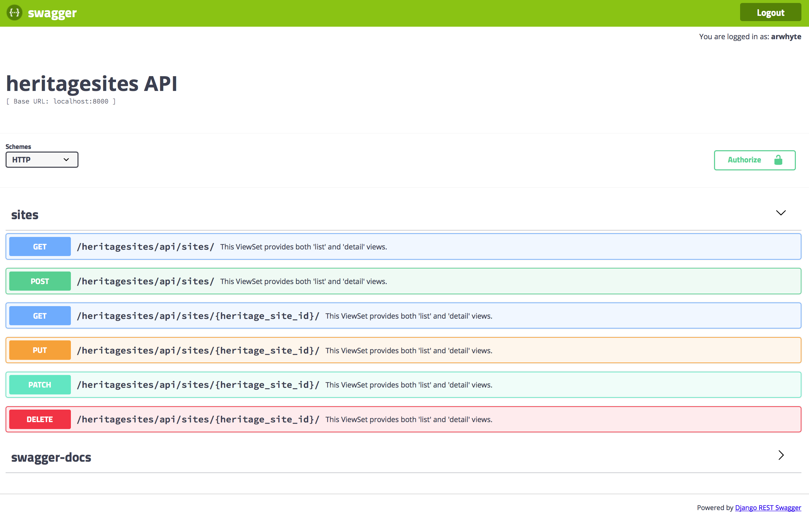

# Meeting 10 Exercise

In this assignment you will

* Revise the MySQL heritage_site_jurisdiction table foreign key (FK) constraints as well as update
the `heritagesites/models.py` foreign key constraints
* Add a `heritagesites` REST API using the Django REST framework (DRF)
* Enhance Authz permissions with token-based authentication
* Generate API documentation
* Stage, commit, and push your changes to your Github `heritagesites` repo

## 1.0 Database changes
If you have forked the [SI664-scripts](https://github.com/UMSI-SI664-2018Fall/SI664-scripts) do
a `git pull` to retrieve the latest changes.  Otherwise, clone or download the repo to get the
code.

You will use [run_mysql_script.py](https://github.com/UMSI-SI664-2018Fall/SI664-scripts/blob/master/scripts/run_mysql_script.py) to execute `unesco_heritage_sites_heritage_site_jurisdiction_cascade.sql`, a SQL script designed to replace two foreign keys with a new `ON DELETE CASCADE` directive.

```commandline
(venv) $ python3 run_mysql_script.py -c ./path/to/config/*.yaml -p
./path/to/unesco_heritage_sites_heritage_site_jurisdiction_cascade.sql
```

### 1.1 Update your *.yaml config file
Add a `port` entry to your *.yaml config file.  The default value is
"3306" (a few students run MySQL on a different port, thus the need for this change).

#### Example: yaml file settings
```yaml
###########################
#   Database connection   #
##########################

mysql:
  host: localhost (or 127.0.0.1)
  port: <the port number, typically 3306>
  user: <Your user account name>
  passwd: <Your password>
  db: unesco_heritage_sites
  local_infile: True
```

### 1.2 Run the SQL script
The `heritagesites` API will include an endpoint for deleting heritage sites. When an HTTP DELETE
 request is sent to `http://localhost:8000/heritagesites/api/sites/{heritage_site_id}` both the heritage site resource *and* all the many-to-many (M2M) relationships between the site and countries/areas that are stored in the `heritage_site_jurisdiction` table must be deleted in order to ensure that referential integrity is maintained.

The existing foreign key constraints defined in the `heritage_site_jurisdiction` schema must be updated to allow MySQL to perform *cascading* deletes on the `heritage_site_jurisdiction` table. Modifying foreign key constraints is a two step process.  First, the script drops the existing constraints.  Second, the script adds the new constraints including the `ON DELETE CASCADE` directive.

#### Example: Foreign Key ON DELETE CASCADE constraint
```mysql
ALTER TABLE heritage_site_jurisdiction
            ADD CONSTRAINT heritage_site_fk_heritage_site_id
                           FOREIGN KEY (heritage_site_id)
                           REFERENCES heritage_site(heritage_site_id)
                           ON DELETE CASCADE ON UPDATE CASCADE;
```

:bulb: Remember to create a virtual environment before you attempt to execute `run_mysql_script.py`. Use the `pip` [requirements.txt](https://github.com/UMSI-SI664-2018Fall/SI664-scripts/blob/master/requirements.txt) file to install the necessary packages.

```commandline
(venv) $ pip3 install -r requirements.txt
```

Run [run_mysql_script.py](https://github.com/UMSI-SI664-2018Fall/SI664-scripts/blob/master/scripts/run_mysql_script.py) to execute the two `ALTER TABLE` statements on the `heritage_site_jurisdiction` table.

```commandline
(venv) $ python3 run_mysql_script.py -c ./config/unesco_heritage_sites-v1p0.yaml -p ./input/sql/unesco_heritage_sites_heritage_site_jurisdiction_cascade.sql

INFO: Connection created.
INFO: Cursor created.
INFO: Statement executed:
--
-- WARNING: before running this script confirm that the foreign key names in the ALTER TABLE
-- statement are correct before executing this script.
--

-- Drop heritage_site_jurisdiction foreign keys (and constraints)
ALTER TABLE heritage_site_jurisdiction
            DROP FOREIGN KEY heritage_site_jurisdiction_ibfk_1,
            DROP FOREIGN KEY heritage_site_jurisdiction_ibfk_2

INFO: Statement executed:

ALTER TABLE heritage_site_jurisdiction
            ADD CONSTRAINT heritage_site_fk_heritage_site_id
                           FOREIGN KEY (heritage_site_id)
                           REFERENCES heritage_site(heritage_site_id)
                           ON DELETE CASCADE ON UPDATE CASCADE,
            ADD CONSTRAINT country_area_fk_country_area_id
                           FOREIGN KEY (country_area_id)
                           REFERENCES country_area(country_area_id)
                           ON DELETE CASCADE ON UPDATE CASCADE

INFO: Changes committed.
INFO: Cursor closed.
INFO: Connection closed.
```

:blub: In MySQL Workbench, open the `unesco_heritage_sites` table view in the left menu and
click on the "wrench" icon in order to launch a table editing pane.  Then click on the "Foreign
Keys" tab to view the new `CASCADE` On Update constraint.

### 1.3 heritagesites models.py changes
The `HeritageSiteJurisdiction` model includes two `models.ForeignKey()` fields that map to the
foreign keys in the `heritage_site_jurisdiction` table:

```python
heritage_site = models.ForeignKey(HeritageSite, models.DO_NOTHING)
country_area = models.ForeignKey(CountryArea, models.DO_NOTHING)
```

If a `HeritageSite` instance or `CountryArea` instance is deleted the associated many-to-many relationships that are stored in the `heritage_site_jurisdiction` must also be deleted in order to ensure referential integrity. As described above MySQL can handle this cleanup automatically whenever an `ON DELETE CASCADE` setting is placed on the "child" foreign key constraint. Django can also specify this behavior on a `models.ForeignKey()` field by specifying the `on_delete=models.CASCADE` argument.

Change the current argument from argument `models.DO_NOTHING` to `on_delete=models.CASCADE`:

```python
class HeritageSiteJurisdiction(models.Model):
	"""
	PK added to satisfy Django requirement.  Both heritage_site and country_area
	entries will be deleted if corresponding parent record in the heritage_site or country_area
	table is deleted.  This mirrors CONSTRAINT behavior in the MySQL back-end.
	"""
	heritage_site_jurisdiction_id = models.AutoField(primary_key=True)
	heritage_site = models.ForeignKey(HeritageSite, on_delete=models.CASCADE)
	country_area = models.ForeignKey(CountryArea, on_delete=models.CASCADE)

	class Meta:
		managed = False
		db_table = 'heritage_site_jurisdiction'
		ordering = ['heritage_site', 'country_area']
		verbose_name = 'UNESCO Heritage Site Jurisdiction'
		verbose_name_plural = 'UNESCO Heritage Site Jurisdictions'
```

### 1.4 Protect other foreign key lookups
On all other `models.ForeignKey()` fields change the argument `models.DO_NOTHING` to
`on_delete=models.PROTECT`:

#### Example: on_delete=models.PROTECT
```python
class HeritageSite(models.Model):
	# ...
	heritage_site_category = models.ForeignKey('HeritageSiteCategory', on_delete=models.PROTECT)
```

## 2.0 Install the Django REST framework
You will utilize the `django-rest-framework` to build a `heritagesites` REST API that will feature a number of heritage site CRUD-related endpoints.

### 2.1 Install the django-rest-framework
Install the [djangorestframework](https://pypi.org/project/djangorestframework/) package:

```commandline
(venv) $ pip3 install djangorestframework
```

### 2.1 Register rest_framework
Add `rest_framework` to `mysite/settings.py` INSTALLED_APPS:

```python
INSTALLED_APPS = [
    # ...

    # Local
    'api.apps.ApiConfig',
    'heritagesites.apps.HeritagesitesConfig',

    # Third-party
    'crispy_forms',
    'django_filters',
    'rest_framework'
]
```

### 2.2 Additional settings
Add a `REST_FRAMEWORK` setting to `mysite/settings.py`:

```python
# Use Django's standard `django.contrib.auth` permissions, or allow read-only access for
# unauthenticated users.
# Default Auth: Basic (retired in favor of TokenAuth)
# Default Auth: SessionAuth (required by browsable API)
REST_FRAMEWORK = {
    'DEFAULT_AUTHENTICATION_CLASSES': [
        'rest_framework.authentication.TokenAuthentication',
        'rest_framework.authentication.SessionAuthentication'
    ],
    'DEFAULT_PERMISSION_CLASSES': [
	    'rest_framework.permissions.IsAuthenticatedOrReadOnly'
        # 'rest_framework.permissions.DjangoModelPermissionsOrAnonReadOnly'
        # 'rest_framework.permissions.AllowAny'
    ],
    'DEFAULT_PAGINATION_CLASS': 'rest_framework.pagination.PageNumberPagination',
    'PAGE_SIZE': 10
}
```

### 2.3 Install django-cors-headers
Security issues arise when attempting to communicate with an API hosted on a different domain or
port.  Cross-Origin Resource Sharing (CORS) requires that a server include specific HTTP headers
that allow for the client to determine if and when cross-origin domain requests should be permitted.

Install the following [django-cors-headers](https://pypi.org/project/django-cors-headers/) middleware to add the HTTP headers automatically:

```commandline
(venv) $ pip3 install django-cors-headers
```

### 2.4 Register corsheaders
Add `corsheaders` to `mysite/settings.py` INSTALLED_APPS:

```python
INSTALLED_APPS = [
    # ...

    # Local
    'api.apps.ApiConfig',
    'heritagesites.apps.HeritagesitesConfig',

    # Third-party
    'corsheaders',
    'crispy_forms',
    'django_filters',
    'rest_framework'
]
```

### 2.5 Add middleware entries
Add two new middleware entries to the MIDDLEWARE setting:

* 'corsheaders.middleware.CorsMiddleware'
* 'django.middleware.common.CommonMiddleware'

Place the two middleware entries **first** and **second**, respectively, in the MIDDLEWARE setting
list.

:warning: Per the django-cores-headers project description: "CorsMiddleware should be placed as
high as possible, especially before any middleware that can generate responses such as Django’s
CommonMiddleware or Whitenoise’s WhiteNoiseMiddleware. If it is not before, it will not be able
to add the CORS headers to these responses. Also if you are using CORS_REPLACE_HTTPS_REFERER it
should be placed before Django’s CsrfViewMiddleware . . . ."

```python
MIDDLEWARE = [
    'corsheaders.middleware.CorsMiddleware',
    'django.middleware.common.CommonMiddleware',
    # ...
]
```

### 2.6 Add CORS white list
Add a `CORS_ORIGIN_WHITELIST` setting to `mysite/settings.py`:

```python
# A list of origin hostnames that are authorized to make cross-site HTTP requests.
# The value 'null' can also appear in this list, and will match the Origin: null header
# that is used in “privacy-sensitive contexts”, such as when the client is running from
# a file:// domain. Defaults to [].
# Port 3000 is the default port for React apps.
CORS_ORIGIN_WHITELIST = (
    '127.0.0.1:3000/'
)
```

## 3.0 User permissions
The `heritagesites` API will use token authentication to secure its endpoints. User registration
will include the generation of a unique token that must be included in the HTTP Authorization
request header of every message transmitted to the server from a client.

### 3.1 Register the authtoken app
The `REST_FRAMEWORK` settings added above provides for Token Authentication.  The Django REST
 framework includes an `authtoken` app for minting tokens. Simply add `rest_framework.authtoken` to the list of
 `INSTALLED_APPS`:

 ```python
INSTALLED_APPS = [
    # ...

    # Local
    'api.apps.ApiConfig',
    'heritagesites.apps.HeritagesitesConfig',

    # Third-party
    'corsheaders',
    'crispy_forms',
    'django_filters',
    'rest_framework',
    'rest_framework.authtoken',

    # ...
]
```

Stop the server (if running) and perform a migration:

```commandline
(venv) $ python3 manage.py migrate
Operations to perform:
  Apply all migrations: admin, auth, authtoken, contenttypes, sessions, social_django
Running migrations:
  Applying authtoken.0001_initial... OK
/Users/arwhyte/Development/repos/github/UMSI-SI664-2018Fall/heritagesites/venv/lib/python3.7/site-packages/django/db/backends/mysql/base.py:71: Warning: (3719, "'utf8' is currently an alias for the character set UTF8MB3, but will be an alias for UTF8MB4 in a future release. Please consider using UTF8MB4 in order to be unambiguous.")
  return self.cursor.execute(query, args)
  Applying authtoken.0002_auto_20160226_1747... OK
```

### 3.2 Install django-rest-auth
Install [django-rest-auth](https://pypi.org/project/django-rest-auth/) to add log in, log out,
and password reset endpoints.  Stop the server, if running, and install the package:

```commandline
(venv) $ pip3 install django-rest-auth
```

### 3.3 Register rest_auth
Add `rest_auth` to `mysite/settings.py` INSTALLED_APPS:

```python
INSTALLED_APPS = [
    # ...

    # Third-party
    'corsheaders',
    'crispy_forms',
    'django_filters',
    'rest_framework',
    'rest_framework.authtoken',
    'rest_auth',

    # ...
]
```

### 3.4 Add a new project route
Add a `rest-auth` path to the project (not app) `urls.py` file:

```python
path('heritagesites/api/rest-auth/', include('rest_auth.urls')),
```

### 3.5 Add user registration
Install `django-allauth`, a package that provides

> an integrated set of Django applications addressing authentication, registration, account management as well as 3rd party (social) account authentication.

```commandline
(venv) $ pip3 install django-allauth
```

### 3.6 Register new apps
Register the following apps:

* `django.contrib.sites`
* `allauth`
* `allauth.account`
* `allauth.socialaccount`
* `rest_auth.registration`

```python
INSTALLED_APPS = [
    # ...
    'django.contrib.sites',

    # Local
    'api.apps.ApiConfig',
    'heritagesites.apps.HeritagesitesConfig',

    # Third-party
    'corsheaders',
    'crispy_forms',
    'django_filters',
    'rest_framework',
    'rest_framework.authtoken',
    'allauth',
    'allauth.account',
    'allauth.socialaccount',
    'rest_auth',
    'rest_auth.registration',
    'social_django',
    'test_without_migrations',
]
```

Also add the following two settings to `mysite/settings.py`:

```python
EMAIL_BACKEND = 'django.core.mail.backends.console.EmailBackend'

SITE_ID = 1
```

:bulb: `django-allauth` uses Django's site framework and requires that a `SITE_ID` be specified.
Registration emails will also be generated but in lieu of setting up an email server, the
messages will be directed to the console.

### 3.7 Run migrations

```commandline
python3 manage.py migrate
Operations to perform:
  Apply all migrations: account, admin, auth, authtoken, contenttypes, sessions, sites, social_django, socialaccount
Running migrations:
  Applying account.0001_initial... OK
  Applying account.0002_email_max_length... OK
  Applying sites.0001_initial... OK
  Applying sites.0002_alter_domain_unique... OK
  Applying socialaccount.0001_initial... OK
  Applying socialaccount.0002_token_max_lengths... OK
  Applying socialaccount.0003_extra_data_default_dict... OK
```

### 3.8 Add a new route
Add a `rest-auth/registration/` path to the project (not app) `urls.py` file:

```python
path('heritagesites/api/rest-auth/registration/', include('rest_auth.registration.urls'))
```

## 4.0 Documentation
With the right libraries installed you can provide auto-generated machine-readable `heritagesites`
API schema as well as human-friendly API documentation that describes available endpoints and
supported operations.

### 4.1 Install coreapi and pyyaml
Install the Python `coreapi` package along with the `pyyaml` package:

```commandline
(venv) $ pip3 install coreapi pyyaml
```

### 4.2 Install django-rest-swagger
Install the [django-rest-swagger](https://pypi.org/project/django-rest-swagger/) package, an
API document generator that implements the [OpenAPI Specification](https://swagger.io/specification/):

```commandline
$ pip3 install django-rest-swagger
```

### 4.3 Register rest_framework_swagger
Add `rest_framework_swagger` to `mysite/settings.py` INSTALLED_APPS:

```python
INSTALLED_APPS = [
    # ...

    'rest_auth.registration',
    'rest_framework_swagger',
    'social_django',
    'test_without_migrations',
]
```

## 5.0 Create a Django api app
The `heritagesites` REST API views, serializers, routes, a browsable API and Swagger API
documentation will live in an "api" app separate from the `heritagesites` webapp.

### 5.1 Create a new api app
In the `heritagesites/` *project* directory create a new Django app called "api".

:warning: do *not* create this app in the `heritagesites` app directory. Create it in the parent or root *project* directory.

```commandline
(venv)$ python3 manage.py startapp api
```
### 5.2 Register the api app
In `mysites/settings.py` register the new app:

```python
INSTALLED_APPS = [
    # ...

    # Local
    'api.apps.ApiConfig',
    'heritagesites.apps.HeritagesitesConfig',

    # Third-party
    # ...
]
```

### 5.3 Add a project-level api route
Add the following routes to `mysite/urls.py`:

```python
path('api-auth/', include('rest_framework.urls')),
path('heritagesites/api/', include('api.urls')),
```

:bulb: the `api-auth` route adds log in/log out functionality to the browsable API.

### 5.4 Delete the api app models.py file
Delete `api/models.py`. `heritagesites` models are maintained outside the api app.

### 5.5 Add an api app urls.py file
Create an `api/urls.py` file with code copied from the SI664-docs repo assignment 10
[urls.py](./static/code/assignment_v10p2/urls.py) file.

### 5.6 Add an api app serializers.py
Create an `api/serializers.py` file with code copied from the SI664-docs repo assignment 10
[serializers.py](./static/code/assignment_v10p2/serializers.py) file.

### 5.7 Add an api app views.py
Create an `api/views.py` file with code copied from the SI664-docs repo assignment 10
[views.py](./static/code/assignment_v10p2/view.py) file.
The file adds a `SiteViewSet` class that provides both 'list' and 'detail' views of serialized `HeritageSite` objects.

## 6.0 Available endpoints
Start up the development server. Go to http://localhost:8000/heritagesites/api/swagger-docs/ (or http://127.0.0.1:8000/heritagesites/api/swagger-docs/).

### 6.1 Unauthenticated endpoints
The `heritagesites` API should now expose the following endpoints accessable by anonymous users:

#### Unauthenticated rest_auth endpoints


#### Unauthenticated heritage sites endpoints


### 6.2 Authenticated endpoints
Authenticated users will be able to access the following `heritagesites` CRUD endpoints:

#### Authenticated: rest_auth endpoints


#### Authenticated: heritage site endpoints


If the Swagger API documentation is not accessible recheck your work.

## 7.0 Document your work
Create a temporary directory to hold a number of files that you will submit as evidence that you have completed the assignment successfully.  Name it:

`<uniqname>-si664-mtg10`

### 7.1 Add a token for an existing user
Log in to http://localhost:8000/admin/login/?next=/admin/.  Under Site Administration click on the Tokens "Add" link:

 

Select a user and add a token. Take a screenshot of http://localhost:8000/admin/authtoken/token/ and name it:

`<uniqname>-mtg10-current_user_token.png`

Place it in your `<uniqname>-mtg10` directory.

### 7.2 Register a new user
Go to http://localhost:8000/heritagesites/api/rest-auth/registration/.  Fill out the registration form and POST it.

:warning: This screen is designed for use by unauthenticated users. Make sure no user is currently logged in before attempting to register a user. Otherwise, you are liable to HTTP 403 error `{"detail": "CSRF Failed: CSRF token missing or incorrect."}` when registering a user while logged in.


A successful registration will include the generation of a token. You can save it locally or look it up in the Admin site. A token will be required later in the exercise when you use Postman to send HTTP requests to the `heritagesites` API.


Take a screenshot of http://localhost:8000/admin/authtoken/token/ and name it:

`<uniqname>-mtg10-new_user_token.png`

Place it in your `<uniqname>-mtg10` directory.

### 7.3 Swagger API
Go to http://localhost:8000/heritagesites/api/swagger-docs/. If viewing as an anonymous user, log in as your new user. Click on the "sites" set of endpoints and take a screenshot and name it:

`<uniqname>-mtg10-new_user_swagger.png`

Place it in your `<uniqname>-mtg10` directory.

### 7.4 GET Request with Postman
The final assignment deliverables involve sending HTTP requests to the `heritagesites` API.  You
can use the CLI tool [curl](https://curl.haxx.se/) to do so but an excellent GUI called [Postman]
(https://www.getpostman.com/) makes for an excellent substitute. Use it for this final portion of
the assignment.

:bulb: Postman also makes available a browser extension for Chrome called [Interceptor](https://chrome.google
.com/webstore/detail/postman-interceptor/aicmkgpgakddgnaphhhpliifpcfhicfo/) that you can also
install, although it is not required for this assignment.

Install the [Postman](https://www.getpostman.com/apps) binary appropriate for your operating
system. If you have never used Postman review the [documentation](https://www.getpostman
.com/docs/v6/) before attempting to send a request to the `heritagesites` API.

When ready use Postman to issue a GET request to
http://localhost:8000/heritagesites/api/sites/1092/.  Select "GET" from the dropdown, provide the endpoint, and then click the blue "Send" button.

:warning: do not forget to add the trailing slash "/" to the endpoint URL.


Take a screenshot of the Postman screen that includes the JSON response and name it:

`<uniqname>-mtg10-postman_get_site_1092.png`

Place it in your `<uniqname>-mtg10` directory.

### 7.4 POST Request with Postman
Next, add a new Heritage Site (have fun with this, submit a real place) by issuing an HTTP POST to http://localhost:8000/heritagesites/api/sites/. You must create your POST request as follows:

1) Select "POST" from the dropdown.

2) Enter the request URL as http://localhost:8000/heritagesites/api/sites/.

3) Click the "Headers" tab and add the following Request headers:
  * key=Authorization, value=Token \<your token\>
  * key=Content-Type, value=application/json

4) Click on the "Body" tab and specify the payload:
  * click the "raw" button
  * provide a JSON payload as specified in the [Swagger](http://localhost:8000/heritagesites/api/swagger-docs/) `heritagesites` API documentation. Ensure that the payload you create:
    - provides values for all required fields.
    - specifies one or more `country_area_id` values for the `jursidiction_ids` array (the identifiers do not need to be sent as string values).

5) Click the blue "Send" button.

Take a screenshot of the Postman screen that includes the JSON response and name it:

`<uniqname>-mtg10-postman_post_site_new.png`

Place it in your `<uniqname>-mtg10` directory.

### 7.5 PUT Request with Postman
Next, update the new Heritage Site record you just created by issuing an HTTP PUT to http://localhost:8000/heritagesites/api/sites/\{heritage_site_id\}/. You must create your PUT request as follows:

1) Select "PUTT" from the dropdown.

2) Enter the request URL as http://localhost:8000/heritagesites/api/sites/\{heritage_site_id\}/. You must provide the new Heritage Site's `heritage_site_id`.

3) Click the "Headers" tab and add the following Request headers:
  * key=Authorization, value=Token \<your token\>
  * key=Content-Type, value=application/json

4) Click on the "Body" tab and specify the payload adding or modifying one or more values:
  * click the "raw" button
  * provide a JSON payload as specified in the [Swagger](http://localhost:8000/heritagesites/api/swagger-docs/) `heritagesites` API documentation. Ensure that the payload you create:
    - changes or modifies one or more values.
    - provides values for all required fields.
    - specifies one or more `country_area_id` values for the `jursidiction_ids` array (the identifiers do not need to be sent as string values).

5) Click the blue "Send" button.

Take a screenshot of the Postman screen that includes the JSON response and name it:

`<uniqname>-mtg10-postman_put_site_new.png`

Place it in your `<uniqname>-mtg10` directory.

### 7.6 Submit your screenshots
Create a zip archive of

* `<uniqname>-mtg10-current_user_token.png`
* `<uniqname>-mtg10-new_user_token.png`
* `<uniqname>-mtg10-new_user_swagger.png`
* `<uniqname>-mtg10-postman_get_site_1092.png`
* `<uniqname>-mtg10-postman_post_site_new.png`
* `<uniqname>-mtg10-postman_put_site_new.png`

Name the archive `<uniqname>-si664-mtg9.zip`. Go to the Canvas assignment page and submit the zip archive.

### 4.0 Stage, commit and push changes to Github
Stage, commit and push all changes to your Github `heritagesites` repo. I will review your code, in particular the new api app.
