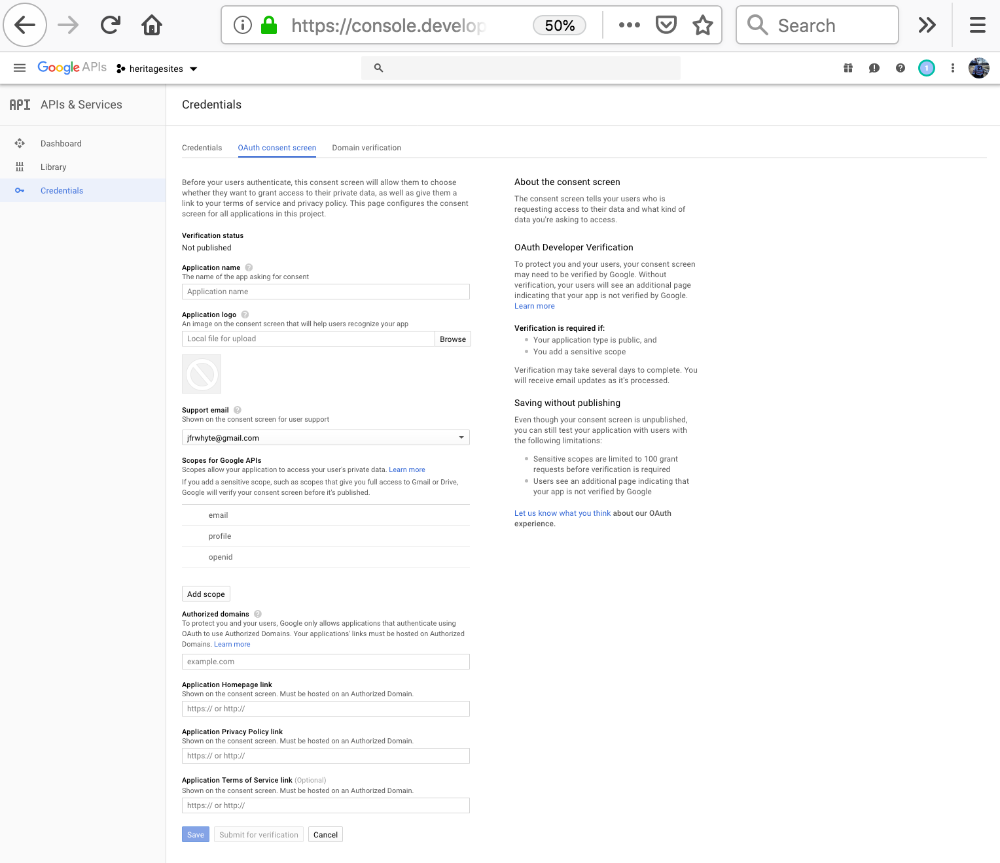
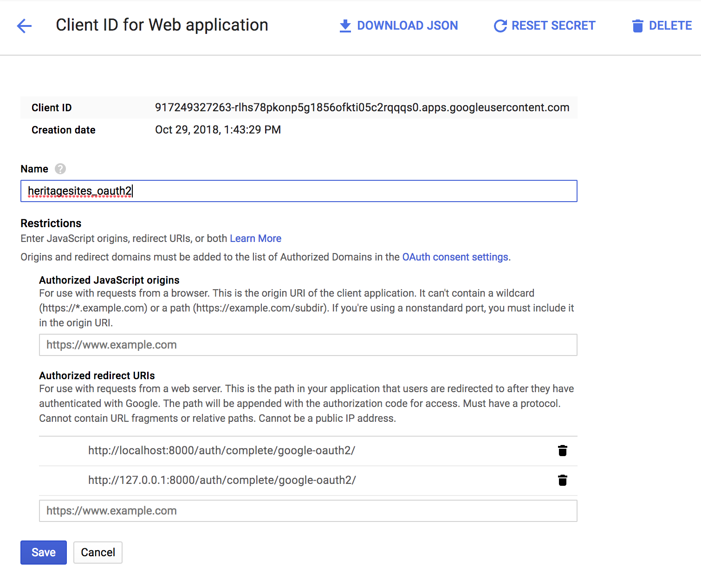

# Meeting 7 Exercise

In this assignment you will

* Install the social-auth-app-django
* Add a Google OAuth2 "social login" to the `heritagesites` app
* Restrict page access to authenticated/authorized users

## 1.0 Installation

### 1.1 Activate the heritagesites virtual environment
```commandline
$ source venv/bin/activate
(venv) kathrada:heritagesites arwhyte$
```

### 1.1 Check installed packages
```commandline
(venv) $ pip3 list
Package                        Version
------------------------------ -------
Django                         2.1.2
django-test-without-migrations 0.6
mysqlclient                    1.3.13
pip                            18.1
pytz                           2018.5
setuptools                     40.4.3
wheel                          0.32.1
```

### 1.2 Get the social-auth-app-django package
Install the [social-auth-app-django/](https://pypi.org/project/social-auth-app-django/) package.

```commandline
(venv) $ pip3 install social-auth-app-django
```

Check the installed packages:

```commandline
(venv) kathrada:heritagesites arwhyte$ pip3 list
Package                        Version
------------------------------ ----------
certifi                        2018.10.15
chardet                        3.0.4
defusedxml                     0.5.0
Django                         2.1.2
django-test-without-migrations 0.6
idna                           2.7
mysqlclient                    1.3.13
oauthlib                       2.1.0
pip                            18.1
PyJWT                          1.6.4
python3-openid                 3.1.0
pytz                           2018.5
requests                       2.20.0
requests-oauthlib              1.0.0
setuptools                     40.4.3
six                            1.11.0
social-auth-app-django         3.0.0
social-auth-core               2.0.0
urllib3                        1.24
wheel                          0.32.1
```

## 2.0 App setup

### 2.1 Register social_django
Add the `social_django` app to `mysite/settings.py` `INSTALLED_APPS` setting:

```python
INSTALLED_APPS = [
    'django.contrib.admin',
    'django.contrib.auth',
    'django.contrib.contenttypes',
    'django.contrib.sessions',
    'django.contrib.messages',
    'django.contrib.staticfiles',
    'heritagesites.apps.HeritagesitesConfig',
    'social_django',                                                        # <-- Add
    'test_without_migrations',
]
```

### 2.2 Perform a database migration

```commandline
(venv)$ python3 manage.py migrate
Operations to perform:
  Apply all migrations: admin, auth, contenttypes, sessions, social_django
Running migrations:
  Applying social_django.0001_initial... OK
  ...
  return self.cursor.execute(query, args)
  Applying social_django.0002_add_related_name... OK
  Applying social_django.0003_alter_email_max_length... OK
  Applying social_django.0004_auto_20160423_0400... OK
  Applying social_django.0005_auto_20160727_2333... OK
  Applying social_django.0006_partial... OK
  Applying social_django.0007_code_timestamp... OK
  Applying social_django.0008_partial_timestamp... OK
```

### 2.3 Add context processors
Add two `social_django` context processors to the `mysite/settings.py` `TEMPLATES` setting:

```python
TEMPLATES = [
    {
        'BACKEND': 'django.template.backends.django.DjangoTemplates',
        'DIRS': [],
        'APP_DIRS': True,
        'OPTIONS': {
            'context_processors': [
                'django.template.context_processors.debug',
                'django.template.context_processors.request',
                'django.contrib.auth.context_processors.auth',
                'django.contrib.messages.context_processors.messages',
                'social_django.context_processors.backends',                     # <-- Add
                'social_django.context_processors.login_redirect',               # <-- Add
            ],
        },
    },
]
```

### 2.4 Add authentication backends
Add the `AUTHENTICATION_BACKENDS` setting to `mysite/setting.py`.  Uncomment `social_core.backends.google.GoogleOAuth2`
and `django.contrib.auth.backends.ModelBackend`.

:bulb: The default Django `ModelBackend` is required for login access to the admin site.

```python
# Authentication backends
# Must include the default Django Auth ModelBackend for the admin site

AUTHENTICATION_BACKENDS = (
    # 'social_core.backends.open_id.OpenIdAuth',
    # 'social_core.backends.google.GoogleOpenId',
    'social_core.backends.google.GoogleOAuth2',                                  # <-- Uncomment
    # 'social_core.backends.google.GoogleOAuth',
    # 'social_core.backends.twitter.TwitterOAuth',
    # 'social_core.backends.yahoo.YahooOpenId',
    'django.contrib.auth.backends.ModelBackend',                                 # <-- Uncomment
)
```

### 2.5 Add middleware
Add a `social_django.middleware.SocialAuthExceptionMiddleware` class reference as the last element
 in the `mysite/settings.py` `MIDDLEWARE` array:

```python
MIDDLEWARE = [
    'django.middleware.security.SecurityMiddleware',
    'django.contrib.sessions.middleware.SessionMiddleware',
    'django.middleware.common.CommonMiddleware',
    'django.middleware.csrf.CsrfViewMiddleware',
    'django.contrib.auth.middleware.AuthenticationMiddleware',
    'django.contrib.messages.middleware.MessageMiddleware',
    'django.middleware.clickjacking.XFrameOptionsMiddleware',
    'social_django.middleware.SocialAuthExceptionMiddleware',
]
```

## 3.0 Google Authentication
Visit the [Google Developers Console](https://console.developers.google.com/). If prompted with
an updated Terms of Service screen, agree to the terms, select your country of residence ("United
States"), decided if you want email updates, and then click "Accept".

Under "API & Services" click on the "Credentials" link:


Click the blue "Create" button. Provide a project name (e.g., "heritagesites") if prompted.


 Click the "Create credentials" dropdown and select "OAuth client ID"


You will next be prompted to click the blue "Configure a consent screen" button.


Add the following values to the "OAuth consent screen" form:
1. Application name: "heritagesites"
2. Application logo: 
3. Support email: \<uniqname\>@umich.edu
4. Do *not* provide a domain or any links (leave values as is)
5. Click the blue "save" button



On the following "Create OAuth Client ID" screen select "Web Application as the Application type" and then add

1. Name: "heritagesites_oauth2"
2. Authorized Javascript origins: leave as is
3. Authorized redirect URIs: add http://localhost:8000/auth/complete/google-oauth2/
4. Click the blue "create" button



Pause for a moment and add the client ID and the client secret settings to `mysite/settings.py`:

```python
SOCIAL_AUTH_GOOGLE_OAUTH2_KEY = '512268774811-di5h0hu9m2dfjg9qrdrsgv3bggt1gqbp.apps.googleusercontent.com'
SOCIAL_AUTH_GOOGLE_OAUTH2_SECRET = '_3emEmGzdbNVQOIOGaXNQGGi'
```

When done, return to the OAuth client screen and click "OK".


Google provides OAuth2 authentication support by way of its Google+ API.  You must enable the Google+ API in order to ensure OAuth2 support.

Click "Dashboard" under "API & Services".  Then click "+ Enable API and Services".  Then search for "Google+ API".  Select it and then after the page refresh click the blue "Enable" button. Done.


## 4.0 Backend configuration
Backend configuration actually commenced when you added the `SOCIAL_AUTH_GOOGLE_OAUTH2_KEY` and `SOCIAL_AUTH_GOOGLE_OAUTH2_SECRET` settings. A few more settings are required to finish configuring the `heritagesites` app for Google OAuth2 authentication.

### 4.1 Define the social auth URL namespace
Add the following setting to `mysite/settings.py`:

```python
SOCIAL_AUTH_URL_NAMESPACE = 'social'
```
### 4.2 Add Login URLs
Next add the following login URL keys:

```python
LOGIN_URL = '/auth/login/google-oauth2/'
# LOGIN_URL = 'login'

LOGIN_REDIRECT_URL = '/'
LOGOUT_REDIRECT_URL = '/'
```

:bulb: The `social_django` app uses the `LOGIN_URL` setting to redirect the user to Google's authentication page. The `LOGIN_REDIRECT_URL` and `LOGOUT_REDIRECT_URL` settings determine where users will be redirected after logging in or logging out.

## 5.0 Update routes, views, and templates

### 5.1 Add new routes
In `mysite/urls.py` add the following new paths: `auth/`, `login/` (commented out), and `logout/`:

```python
from django.conf import settings
from django.conf.urls.static import static
from django.contrib import admin
from django.contrib.auth.views import LoginView, LogoutView
from django.http import HttpResponseRedirect
from django.urls import path, include

urlpatterns = [
    path('', lambda r: HttpResponseRedirect('heritagesites/')),
    path('admin/', admin.site.urls),
    path('auth/', include('social_django.urls', namespace='social')),
    path('login/', LoginView.as_view(), name='login'),
    path('logout/', LogoutView.as_view(), {'next_page': settings.LOGOUT_REDIRECT_URL},
         name='logout'),
    path('heritagesites/', include('heritagesites.urls')),
] + static(settings.STATIC_URL, document_root=settings.STATIC_ROOT)
```

### 5.2 Add view decorators
Next limit access to the `CountryArea` views and templates you created during the midterm to authenticated users only. If you did not finish creating either `CountryAreaListView(generic.ListView)` or `CountryAreaDetailView(generic.DetailView)` revisit [section 4.0](https://github.com/UMSI-SI664-2018Fall/SI664-docs/blob/master/exams/si664_midterm-20181023.md#app) of the midterm and complete sub-section [4.1.1](https://github.com/UMSI-SI664-2018Fall/SI664-docs/blob/master/exams/si664_midterm-20181023.md#411-add-new-views).

Once the two classes are in place in `heritagesites/views.py` add a `dipatch` method and a class decorator to the `CountryAreaListView(generic.ListView)` class.  The class decoration will trigger an Authz check whenever the view is called.

```python
from django.contrib.auth.decorators import login_required
from django.utils.decorators import method_decorator
```

```python
@method_decorator(login_required, name='dispatch')
class CountryAreaListView(generic.ListView):
	model = CountryArea
	context_object_name = 'countries'
	template_name = 'heritagesites/country_area.html'
	paginate_by = 20

	def dispatch(self, *args, **kwargs):
		return super().dispatch(*args, **kwargs)

	def get_queryset(self):
		return CountryArea.objects\
			.select_related('dev_status', 'location')\
			.order_by('country_area_name')

```

Do the same for `CountryAreaDetailView(generic.DetailView)`, adding a `dispatch` method and `@method_decorator`.

### 5.3 Create Login / Logout templates
In the `heritagesites/templates` directory create a new `registration` directory.  that includes the following new templates: `login.html` and `logout.html`.  We will be discussing Django forms in more detail next week so don't sweat the details regarding the template tags between the `<form> .... </form>` tags.

##### login.html
```html




  <header>
    <h2>UNESCO Heritage Sites Login</h2>
  </header>

  <p>Connect with a social network:</p>

  <a href="">Sign in with Google</a>
  <p>&nbsp;</p>
  <p>Sign in with your email address and password:</p>

  <form method="post">
    
    {{ form.as_p }}
    <button type="submit">Login</button>
  </form>


```

##### logout.html
```html




  <header>
    <h2>UNESCO Heritage Sites Logout Page</h2>
  </header>

  <h2>Login</h2>
  <a href="">Login with Google</a><br>


```

### 5.4 Reduce code duplication
Before updating the `country_area.html` and `country_area_detail.html` templates, take a moment to reduce a bit of code duplication that has crept into the `heritagesites` app.  Create a template called `pagination.html`.  Move the pagination code (`<nav> ... </nav>`) out of `site.html` and
into `pagination.html`. Replace the code removed from `site.html` with an `include` template tag:

```html

```

Do the same for `country_area.html`.

### 5.5 Restrict access to country/area templates
Add the `user.is_authenticated` template tag check to both `country_area.html` and
`country_area_detail.html`.  Each template should be scaffolded as follows:

```html


  

    <!-- render content here if user is authenticated -->

  
    <a href="">Log in</a>
  
}
```

### 5.6 Add a login link to the navigation bar
Add a login link to the `base.html` navigation bar. Add the `mr-auto` class to the <ul> tag to push the menu items to the right:

```html
<ul class="navbar-nav mr-auto">
  <!-- existing list items -->
</ul>

<ul class="navbar-nav mr-auto">
  <li class="nav-item">
    <a class="nav-link" href="">login</a>
  </li>
</ul>
```

## 6.0 Test the integration and document your work
Start up the Django development server and load `http://localhost:8000/heritagesites/` in your browser.  You need to take a couple of screenshots to complete the assignment.

### 6.1 Google sign in page screenshot
Click on the "country/area" navigation bar link.  You should be redirected to the Google sign in screen.


If clicking on the "country/area" link does not result in a redirect to the Google sign in page review your work above, make corrections, and try it again.  If you encounter issues ping the class using the Canvas discussion tool or drop me a note at [arwhyte@umich.edu](mailto:arwhyte@umich.edu).

__Before signing in__, take a screenshot of the sign in page displaying the list of Google accounts that you can use.  Rename the screenshot `<uniqname>-google_sign_in.png`.

Sign in and Google will redirect you back to the `heritagsites` app.  You should be able to view the list of countries/areas.

:bulb: If you sign in to Google before obtaining a screenshot of the sign in page, clear your browser history and cache, close/restart your browser, load `http://localhost:8000/heritagesites/` and click on the "country/area" navigation bar link again.

### 6.2 heritagesites screenshot
On the "Countries and Areas" list page click on page 13 and take a screenshot.  Rename the screenshot `<uniqname>-heritagesites_country_area_pg13.png`.


### 6.3 Django admin site users page screenshot
Sign in to the Django admin site at `http://localhost:8000/admin/` as the superuser.  Under "Authentication and Authorization administration" click on the "Users" link.  Take a screenshot of the users listed.

:bulb: If you signed in via Google with your UMich user account you should see a uniqname with a string of characters appended to the name (which is good).  Take a screenshot of the page. Rename the screenshot `<uniqname>-heritagesites_admin_users.png`.


### 6.4 Submit your screenshots
Create a zip archive of

* `<uniqname>-google_sign_in.png`
* `<uniqname>-heritagesites_country_area_pg13.png`
* `<uniqname>-heritagesites_admin_users.png`

Name the archive `<uniqname>-si664-mtg7.zip`. Go to the Canvas assignment page and submit the zip archive.
