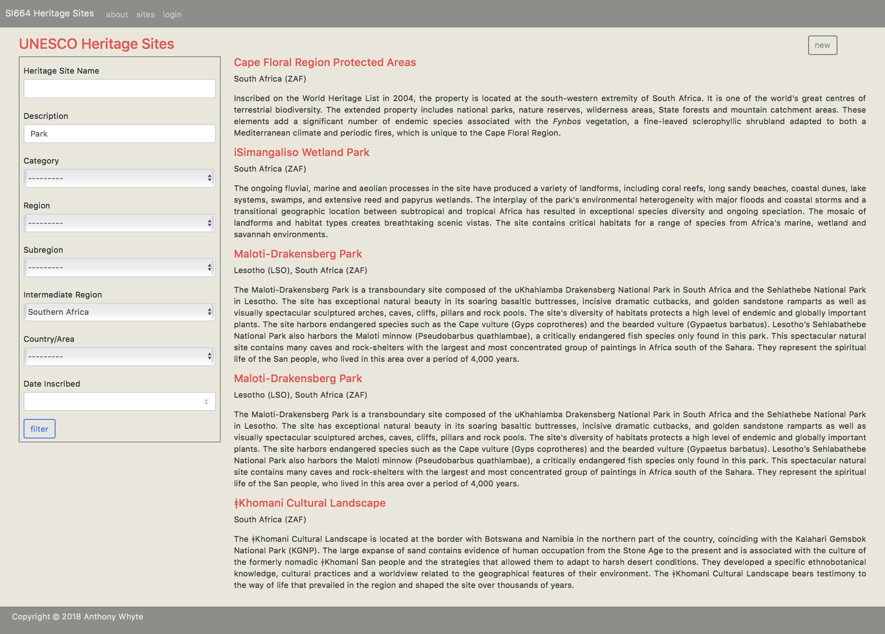
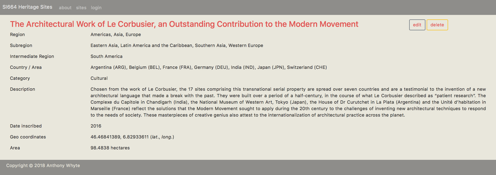
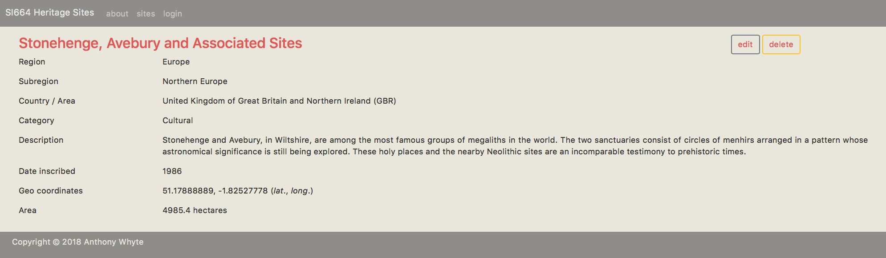

# Meeting 9 Exercise

In this assignment you will

* Install and configue django-filter
* Implement a search form
* Replace template tags and variables with model code
* Stage, commit, and push your changes to your Github `heritagesites` repo

## 1.0 Installation

### 1.1 Read django-filter docs
This week you will install the django-filter package and implement a filtering mechanism designed
 to simplify retrieval of Heritage Site information.

Start by reading the django-filter [documentation](https://django-filter.readthedocs
.io/en/master/index.html). Focus on the following sections:

* User Guide
  - [Installation](https://django-filter.readthedocs.io/en/master/guide/install.html)
  - [Getting Started](https://django-filter.readthedocs.io/en/master/guide/usage.html)
  - [Tips and Solutions](https://django-filter.readthedocs.io/en/master/guide/tips.html)
* Reference
  - [FilterSet Options](https://django-filter.readthedocs.io/en/master/ref/filterset.html)
  - [Filter Reference](https://django-filter.readthedocs.io/en/master/ref/filters.html)
  - [Field Reference](https://django-filter.readthedocs.io/en/master/ref/fields.html)

### 1.2 Activate the heritagesites virtual environment

##### macOS
```commandline
$ source venv/bin/activate
(venv) $
```

##### Windows
```commandline
> venv\Scripts\activate
(venv) >
```

### 1.3 Get django-filter
Install the [django-filter/](https://pypi.org/project/django-filter/) package.

##### macOS
```commandline
(venv) $ pip3 install django-filter
```

##### Windows
```commandline
(venv) > pip install django-filter
```

### 1.4 Register django_filters
Add the `django_filters` app to `mysite/settings.py` `INSTALLED_APPS`:

```python
INSTALLED_APPS = [
    'django.contrib.admin',
    'django.contrib.auth',
    'django.contrib.contenttypes',
    'django.contrib.sessions',
    'django.contrib.messages',
    'django.contrib.staticfiles',
    'heritagesites.apps.HeritagesitesConfig',
    'crispy_forms',
    'django_filters',
    'social_django',
    'test_without_migrations',
]
```

## 2.0 Django models, filters, views, routes and templates

### 2.1 Modify models.py
Add a new model method annotated as a property to the `HeritageSite` model in
`heritagesites/models.py`. Name the method `country_area_names`. Place it after the `__str__(self)` and `get_absolute_url(self)` methods.

```python
@property
def country_area_names(self):
    """
    Returns a list of UNSD countries/areas (names only) associated with a Heritage Site.
    Note that not all Heritage Sites are associated with a country/area (e.g., Old City
    Walls of Jerusalem). In such cases the Queryset will return as <QuerySet [None]> and the
    list will need to be checked for None or a TypeError (sequence item 0: expected str
    instance, NoneType found) runtime error will be thrown.
    :return: string
    """
    countries = self.country_area.select_related('location').order_by('country_area_name')

    names = []
    for country in countries:
        name = country.country_area_name
        if name is None:
            continue
        iso_code = country.iso_alpha3_code

        name_and_code = ''.join([name, ' (', iso_code, ')'])
        if name_and_code not in names:
            names.append(name_and_code)

    return ', '.join(names)
```

This model method adds an additional property to the `HeritageSite` model that returns a
comma-delimited string of countries/areas associated with a Heritage Site model instance. Each
item in the comma-delimited string will be displayed as "\<country_area_name\>
(\<iso_alpha3_code\>)".

Add three more model methods, each annotated with the `@property` decorator.  Name the methods:

* `region_names`
* `sub_region_names`
* `intermediate_region_names`

For each method write Python code that uses `self` to retrieve a `QuerySet` composed of either regions, subregions, or intermediate regions, sorted by the name value in ascending order. Then loop over the `QuerySet` constructing a list of name values, before returning a comma-delimited string of the names. The goal is to add additional model methods that will replace the over use of conditional template variable expressions in `site_detail.html`.

:warning: Heed the doc string comments. Not all heritage sites are linked to a region, subregion, or
intermediate region. You need to check for `None` when looping through each `QuerySet` and
attempting to extract values.

```python
@property
	def region_names(self):
		"""
		Returns a list of UNSD regions (names only) associated with a Heritage Site.
		Note that not all Heritage Sites are associated with a region. In such cases the
		Queryset will return as <QuerySet [None]> and the list will need to be checked for
		None or a TypeError (sequence item 0: expected str instance, NoneType found) runtime
		error will be thrown.
		:return: string
		"""

		# Add code that uses self to retrieve a QuerySet composed of regions, then loops over it
		# building a list of region names, before returning a comma-delimited string of names.

		return ', '.join(names)

	@property
	def sub_region_names(self):
		"""
		Returns a list of UNSD subregions (names only) associated with a Heritage Site.
		Note that not all Heritage Sites are associated with a subregion. In such cases the
		Queryset will return as <QuerySet [None]> and the list will need to be checked for
		None or a TypeError (sequence item 0: expected str instance, NoneType found) runtime
		error will be thrown.
		:return: string
		"""

		# Add code that uses self to retrieve a QuerySet, then loops over it building a list of
		# sub region names, before returning a comma-delimited string of names using the string
		# join method.

		return ', '.join(names)

	@property
	def intermediate_region_names(self):
		"""
		Returns a list of UNSD intermediate regions (names only) associated with a Heritage Site.
		Note that not all Heritage Sites are associated with an intermediate region. In such
		cases the Queryset will return as <QuerySet [None]> and the list will need to be
		checked for None or a TypeError (sequence item 0: expected str instance, NoneType found)
		runtime error will be thrown.
		:return: string
		"""

		# Add code that uses self to retrieve a QuerySet, then loops over it building a list of
		# intermediate region names, before returning a comma-delimited string of names using the
		# string join method.

		return ', '.join(names)
```

### 2.2 Add filters.py
Create heritagesites/filters.py and add the following code:

```python
import django_filters
from heritagesites.models import CountryArea, HeritageSite, HeritageSiteCategory, \
	IntermediateRegion, SubRegion, Region


class HeritageSiteFilter(django_filters.FilterSet):
	site_name = django_filters.CharFilter(
		field_name='site_name',
		label='Heritage Site Name',
		lookup_expr='icontains'
	)

	# Add description, heritage_site_category, region, sub_region and intermediate_region filters here

	country_area = django_filters.ModelChoiceFilter(
		field_name='country_area',
		label='Country/Area',
		queryset=CountryArea.objects.all().order_by('country_area_name'),
		lookup_expr='exact'
	)

	# Add date_inscribed filter here


	class Meta:
		model = HeritageSite
		# form = SearchForm
		# fields [] is required, even if empty.
		fields = []
```

:bulb: note that the filter class is based on the `HeritageSite` model.

### 2.3 Add additional filters
Add the following additional filter fields to the `FilterSet` in the following order:

* `site_name` (done)
* `description`
* `heritage_site_category`
* `region`
* `sub_region`
* `intermediate_region`
* `country_area` (done)
* `date_inscribed`

Each new filter field requires that you choose the appropriate django_filters model field (e.g., `django_filters.NumberFilter()`) as well as define the following arguments:

* `field_name` - name of the model field
* `label` - HTML display name
* `lookup_expr` - Django [field lookup](https://docs.djangoproject.com/en/2.1/ref/models/querysets/#field-lookups)
* `queryset` (required by `ModelChoiceFilter()` or `ModelMultipleChoiceFilter()`)

:warning: In certain cases the `field_name` value will require traversing model relationships
 by joining the related models with the ORM lookup separator (__), e.g., `HeritageSite` to `Region` via `CountryArea` and `Location`.

:warning: Note the `QuerySet` expression required for the `country_area` `queryset` argument.  Other filter
fields that provide lookup values will require the same treatment.

:bulb: See the django-filter [Filter Reference](https://django-filter.readthedocs.io/en/master/ref/filters.html) for additional information regarding filter fields and their arguments.

### 2.4 Modify views.py
Add `SiteFilterView()` to `heritagesites/views.py`. You are responsible for adding the necessary
import statements.

:bulb: Note the reference to the newly created `HeritageSiteFilter` class.

```python
class SiteFilterView(FilterView):
	filterset_class = HeritageSiteFilter
	template_name = 'heritagesites/site_filter.html'
```

### 2.5 Modify urls.py
Add a new `path()` to `heritagesites/urls.py`. You need to define three properties:

* route
* view
* ~~kwargs~~ (ignore)
* reverse lookup name

`path(route, view, kwargs=None, name=None)`

### 2.6 Add a filter template
Add a new template. Give it the name referenced in the `SiteFilterView(FilterView)` class.  The form will leverage `crispy_forms`. The skeletal code below requires the following additions in order to make it whole:

* Add a form submit button.
  - Set the button text to "filter".
  - Style the button like the other Bootstrap [outline buttons](https://getbootstrap.com/docs/4.0/components/buttons/#outline-buttons) that feature in the `heritagesites` app.
* Inside the for loop tag, add the following:
  - Between `<h4>...</h4>` add an anchor <a> tag with an `href` attribute set to a `` tag that redirects the user to `site_detail.html` based on the site's primary key value. Set the `<a>..</a>` tag text to the Heritage Site name.
 - Below the `<h4>` tag add `{{ site.country_area_names }}`. Wrap the `{{ site.country_area_names }}` template tag in an ` ... ` tag check.
  - Add the site description template tag below the `{{ site.country_area_names }}` tag. Add the
  `safe` filter. Do not place the template variable inside a `<p> ... </p>`. The paragraph tags are stored in the database and rendered as raw HTML. Wrap the description template tag in an ` ... ` tag check.

```html






  <div class="row">
    <div class="col-sm-3">
      <div class="px-2 py-2" style="border:1px solid #8E8D8A;">
        <form action="" method="get">
          {{ filter.form|crispy }}
          <!-- add a submit button -->
        </form>
      </div>
    </div>
    <div class="col-sm-9">
      
        <h4><!-- add a link to the detail page --></h4>

        <!-- add the country_area_names and description template tags -->

    
      Select one or more filters relevant to your search and then click "filter".
    
    </div>
  </div>

```

### 2.7 Modify site_detail.html
The model methods that you added to the `HeritageSite` model renders redundant the templating
tags used to create strings of regions, subregions, and intermediate regions for heritage sites
that span multiple countries and, in a few cases, regional boundaries.

First, comment out all the code between `` and ``.

```html

  <!-- comment out region, subregion, intermediate_region, country_area rows -->

  <!--
  

  ...

  
  -->
```

Then for each of the rows commented out, replace with a new row that renders the matching region, subregion, intermediate region and country/area names available via the new
`HeritageSite` model properties you created earlier.  Add four new rows and structure each row
 as follows:

```html

    <div class="row">
      <div class="col-sm-2">
        <p>Property</p>
      </div>
      <div class="col-sm-10">
        <p>{{ site.property_name }}</p>
      </div>
    </div>
  
```

### 2.8 update the \<navbar\>
Comment out the countries/areas and sites links.  Add a new sites link with its `href` attribute set to `` set earlier in `heritagesites/urls.py`.

```html
<nav class="navbar navbar-expand-sm navbar-dark navbar-custom sticky-top px-4 py-2">

      <div class="row">
        <a class="navbar-brand" href="">SI664 Heritage Sites</a>

        <ul class="navbar-nav">
          <li class="nav-item">
            <a class="nav-link" href="">about</a>
          </li>
          <li class="nav-item">
            <a class="nav-link" href="">sites</a>
          </li>
          <!--
          <li class="nav-item">
            <a class="nav-link" href="">sites</a>
          </li>
          <li class="nav-item">
            <a class="nav-link" href="">countries/areas</a>
          </li>
          -->
          <li class="nav-item">
            <a class="nav-link" href="">login</a>
          </li>
        </ul>
      </div>
    </nav>
```

## 3.0 Document your work
Start up the Django development server, if not already running. Create a temporary directory to hold a number of files that you will submit as evidence that you have completed the assignment successfully.  Name it:

`<uniqname>-si664-mtg9`

### 3.1 Southern African Parks
Click on the sites link and return a list of Southern African Parks recognized as UNESCO Heritage Sites. Five records will be returned.  Take a screenshot and name it:

`<uniqname>-mtg9-parks.png`

Place it in your `<uniqname>-mtg9` directory.

:warning: Your screenshot must exhibit the look-and-feel of the following screenshot (excepting, of course, the color palette). If not review your work and make corrections.



### 3.2 The Architectural Work of Le Corbusier
Charles-Édouard Jeanneret-Gris, otherwise known as Le Corbusier, was a Swiss French architect who lived between 1887 and 1965. Seventeen of his architectural projects were recognized as UNESCO Heritage Sites in 2016.  Construct a filter and retrieve the Heritage Site entry.  Click on the entry. Take a screenshot of the detail page and name it:

`<uniqname>-mtg9-architect.png`

Place it in your `<uniqname>-mtg9` directory.

:warning: Your screenshot must exhibit the look-and-feel of the following screenshot (excepting, of course, the color palette). If not review your work and make corrections.



### 3.3 Stonehenge, Avebury, and Associated Sites
Construct a filter and retrieve the Heritage Site entry for Stonehenge, perhaps the most famous megalith in the world. Take a screenshot of the detail page and name it:

`<uniqname>-mtg9-stonehenge.png`

Place it in your `<uniqname>-mtg9` directory.

:warning: Your screenshot must exhibit the look-and-feel of the following screenshot (excepting, of course, the color palette). If not review your work and make corrections.



### 3.4 Submit your screenshots
Create a zip archive of

* `<uniqname>-mtg9-parks.png`
* `<uniqname>-mtg9-architect.png`
* `<uniqname>-mtg9-stonehenge.png`

Name the archive `<uniqname>-si664-mtg9.zip`. Go to the Canvas assignment page and submit the zip archive.

### 4.0 Stage, commit and push changes to Github
Stage, commit and push all changes to your Github `heritagesites` repo. I will review your code, in particular:

* `models.py`
* `views.py`
* `urls.py`
* `filters.py`
* `site_filter.html`
* `site_detail.html`
