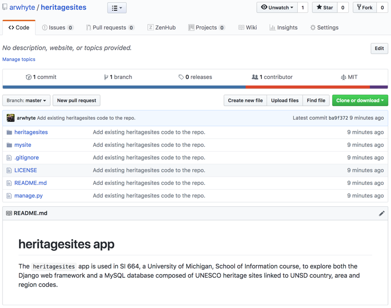

# Version control with Git and Github (macOS)

* 1.0 [Git](#git)
  - 1.1 [Install Git](#git-install)
  - 1.2 [Initialize working directory](#git-init)
* 2.0 [Github](#github)
  - 2.1 [Create account](#github-account)
  - 2.2 [Create heritagsites repository](#github-repo)
* 3.0 [Working directory changes](#work_dir-changes)
  - 3.1 [Add a .gitignore file](#work_dir-gitignore)
  - 3.2 [Add a LICENSE file (optional)](#work_dir-license)
  - 3.3 [Add a README.md file](#work_dir-readme)
  - 3.4 [Review file locations](#work_dir-review)
  - 3.5 [Hide secret key values](#work_dir-secrets)
* 4.0 [Staging, committing and pushing changes](#git-commands)
  - 4.1 [Create a remote](#git-add_remote)
  - 4.2 [Add untracked files](#git-add)
  - 4.3 [Commit staged files](#git-commit)
  - 4.4 [Push commit(s) to remote repository](#git-push)
* 5.0 [Looking ahead: a new workflow](#git-workflow)
* 6.0 [Documentation](#git-documentation)

## <a name="git"></a>1.0 Git

### <a name="git-install"></a>1.1 Install Git
First, confirm whether or not you have Git installed on your laptop:

```commandline
$ git --version
git version 2.19.1
```

If you yet to install Git consider using [Homebrew](https://brew.sh/) to install and maintain Git as described in the SI 664 macOS [setup guide](../install/mac-brew_python_django_mysql-install.md). Switch to the setup guide and install Xcode ([section 1.0](../install/mac-brew_python_django_mysql-install.md#10-install-xcode)), Homebrew ([section 2.0](../install/mac-brew_python_django_mysql-install.md#20-install-homebrew)) and update your `PATH` environment variable ([section 2.1](../install/mac-brew_python_django_mysql-install.md#21-update-the-path-environment-variable)) in order to make it Homebrew-friendly.

Once you have both [Xcode](https://developer.apple.com/xcode/) and Homebrew installed you can install Git from the terminal:

```commandline
$ brew install git
```

If you don't want to use Homebrew, you can also [download](https://git-scm.com/download/mac) Git from the [git-scm](https://git-scm.com/) website and install it manually along with Xcode.

## <a name="git-init"></a>1.2 Initialize working directory
Next, change directories to your Django `heritagesites` project directory and initialize it as a Git repository using the `init` command:

```commandline
$ cd path/to/heritagesites
$ git init
Initialized empty Git repository in /Users/arwhyte/Development/repos/github/arwhyte/heritagesites/.git/
```

Intialization creates a `heritagesites/.git` subdirectory that contains a set of subdirectories that Git utilizes to manage branches, commits, tags, and version history. Initialization also establishes a default `master` branch for tracking your work.

## <a name="github"></a>2.0 Github

### <a name="github-account"></a>2.1 Create account
Git is a distributed version control system. Github is a cloud platform that hosts public and private Git repositories.  If you have yet to create a Github account visit https://github.com/join?source=header-home and set up your account.

## <a name="github-repo"></a>2.2 Create heritagsites repository
Go to your Github account.  Click the "Repositories" tab.  Then click the green "New" button to access the "Create repository" form.


Name the new repo "heritagesites".  Provide a short description.  Keep the repo public.

:warning: Do *not* initialize the repo with a README file or add a .gitignore file and/or license file. You will add each file in your working directory momentarily.

Once you have provided the repo name and added a short description click the green "Create repository" button.  You will be greeted by the following setup screen:


You now have an empty Github repository for hosting your `heritagesites` app code. Leave the browser tab open and switch back to your text editor or IDE.

## <a name="work_dir-changes"></a>3.0 Working directory changes

### <a name="work_dir-gitignore"></a>3.1 Add a .gitignore file
The `.gitignore` file provides a list of directory and file type patterns that Git will read to filter out or ignore untracked files that are to be excluded from Git commits.  Examples of Python- and Django-flavored `.gitignore` files are easy to find. There is even a [gitignore.io](https://www.gitignore.io/) service that will generate a `.gitignore` file for you based on language, IDE, and/or operating system.

You can craft your own `.gitignore` file or use the [.gitignore](./static/.gitignore) file I currently use for my `heritagesites` project.

Whatever you decide to do make sure you place your `.gitignore` file in the top-level directory of your `heritagesites` project.

### <a name="work_dir-license"></a>3.2 Add a LICENSE file (optional)
Default copyright law applies when you place unlicensed software in publicly accessible code repositories.  In other words, you retain all rights to your source code and no one is permitted to reproduce, distribute, or create derivative works of your software. I prefer to provide an explicit statement to potential users in the form of a license that specifies the ownership rights I retain over the software as regards use and redistribution.  As an open-source developer I prefer free and open-source (FOSS) licenses that are considered "permissive", i.e, licenses that grant to others the freedom to use, modify, and redistribute the software I author *as well as* produce derivative proprietary works. This latter feature, permitting reuse within someone else's proprietary software, is what makes licenses of this type *permissive*.

For my `heritagesites` app I chose the commercially friendly [MIT license](https://opensource.org/licenses/MIT):

> Copyright <YEAR> <COPYRIGHT HOLDER>

> Permission is hereby granted, free of charge, to any person obtaining a copy of this software and associated documentation files (the "Software"), to deal in the Software without restriction, including without limitation the rights to use, copy, modify, merge, publish, distribute, sublicense, and/or sell copies of the Software, and to permit persons to whom the Software is furnished to do so, subject to the following conditions:

> The above copyright notice and this permission notice shall be included in all copies or substantial portions of the Software.

> THE SOFTWARE IS PROVIDED "AS IS", WITHOUT WARRANTY OF ANY KIND, EXPRESS OR IMPLIED, INCLUDING BUT NOT LIMITED TO THE WARRANTIES OF MERCHANTABILITY, FITNESS FOR A PARTICULAR PURPOSE AND NONINFRINGEMENT. IN NO EVENT SHALL THE AUTHORS OR COPYRIGHT HOLDERS BE LIABLE FOR ANY CLAIM, DAMAGES OR OTHER LIABILITY, WHETHER IN AN ACTION OF CONTRACT, TORT OR OTHERWISE, ARISING FROM, OUT OF OR IN CONNECTION WITH THE SOFTWARE OR THE USE OR OTHER DEALINGS IN THE SOFTWARE.

Adding a license is optional.  If you choose to license your code using the MIT license, copy the provided [LICENSE](./static/LICENSE) file and place it in the top level directory of your `heritagesites` project.

Replace the copyright declaration placeholder `<YOUR NAME>` with your full legal name:

```
Copyright (c) 2018 Anthony Whyte
```

Other FOSS licenses exist, including "reciprocal" licenses that tend to limit commerical exploitation of software covered under such licenses.  If you decide to opt for a FOSS license other than the MIT license I chose for my `heritagesites` app, consider visiting the Open Source Initiative website and reviewing the list of OSI [approved licenses](https://opensource.org/licenses) and their license terms.

### <a name="work_dir-readme"></a>3.3 Add a README.md file
README files typically provide a brief description of the project as well as installation, configuration, and other relevant information.

Copy the [README.md](/static/README.md) file and place it at the top level of your `heritagesites` project.

### <a name="work_dir-review"></a>3.4 Review file locations
Your `heritagesites` project should now include the following top level directories and files:

```
heritagesites/
  heritagesites/
  mysite/
  venv/
  .gitignore
  LICENSE
  manage.py
  README.md
```

If any of the required or optional files you added are missing add them.  If you placed any
 of the new files in the wrong location, move them.

### <a name="work_dir-secrets"></a>3.5 Hide secret key values
Exposing secret keys in a public repo is a dangerous practice.  Currently, `/mysite/settings.py` contains three secret key/value pairs:

* SECRET_KEY = '\<Django Secret Key\>'
* SOCIAL_AUTH_GOOGLE_OAUTH2_KEY = '\<GOOGLE_OAUTH2_KEY\>'
* SOCIAL_AUTH_GOOGLE_OAUTH2_SECRET = '\<GOOGLE_OAUTH2_SECRET\>'

Choose one of the following options to hide your secret keys:

#### 3.5.1 Option1: add secrets.py
Add a `mysite/secrets.py` file.  Copy the secret key/value pairs to this file.  Import `secrets.py` into `mysite/settings.py` and replace the secret key string values with the associated keys stored in `secrets.py`.

```python
from mysite import secrets

SECRET_KEY = secrets.SECRET_KEY

SOCIAL_AUTH_GOOGLE_OAUTH2_KEY = secrets.SOCIAL_AUTH_GOOGLE_OAUTH2_KEY
SOCIAL_AUTH_GOOGLE_OAUTH2_SECRET = secrets.SOCIAL_AUTH_GOOGLE_OAUTH2_SECRET
```

#### 3.5.2 Option 2: add environment variables
The second option involves creating environment variables to hold your secret key values.

Edit your `.bash_profile`. Create three new environment variables for your secret keys and set the values (use double quotes).

```commandline
# Django
export DJANGO_SECRET_KEY="<your secret value>"

# Google OAuth2 credentials
export SOCIAL_AUTH_GOOGLE_OAUTH2_KEY="<your key value>"
export SOCIAL_AUTH_GOOGLE_OAUTH2_SECRET="<your secret value>"
```

Save your changes and then reload your `.bash_profile`:

```commandline
$ source ~/.bash_profile
```

Switch to `mysite/settings.py` and add an `os` module import if not already present. Set each of the three secret key values to the matching environment variable values:

```python
import os

SECRET_KEY = os.environ.get('DJANGO_SECRET_KEY')

SOCIAL_AUTH_GOOGLE_OAUTH2_KEY = os.environ.get('SOCIAL_AUTH_GOOGLE_OAUTH2_KEY')
SOCIAL_AUTH_GOOGLE_OAUTH2_SECRET = os.environ.get('SOCIAL_AUTH_GOOGLE_OAUTH2_SECRET')
```

:warning: `mysites/secrets.py` __must__ not be stored in your `heritagesites` public repo. Specify a pattern in your `.gitignore` file in order to ensure that it is excluded from Git commits.  This is already done in the example [.gitignore](./static/.gitignore) that you are free to use:

```
### Django secrets ###
**/secrets.py
```

## <a name="git-commands"></a>4.0 Staging, committing and pushing changes

### <a name="git-add_remote"></a>4.1 Create a remote
Since you will be managing ("tracking") both a local working directory and a "remote" repository associated with your Github account you will need to inform Git about the remote repo. Do this by issuing a `remote add` command in the terminal, providing both a name for your new remote (I use "arwhyte", online examples use "origin") and the HTTPS `*.git` path to your remote repository:

```commandline
$ cd path/to/heritagesites
$ git remote add arwhyte https://github.com/arwhyte/heritagesites.git
```

Confirm that you have successfully added the remote:

```commandline
$ git remote -v
arwhyte	https://github.com/arwhyte/heritagesites.git (fetch)
arwhyte	https://github.com/arwhyte/heritagesites.git (push)
```

You can add multiple remotes.  Although not a requirement for your `heritagesites` work you might find yourself some day part of a team tracking multiple repos that are "upstream" from your local working directory and to which you can push code.

### <a name="git-add"></a>4.2 Add untracked files
Next, you need to update the index that Git maintains of content found in the working tree.  The index provides both a snapshot of the current content and a listing of files to be included in the next commit.  Use the `add` command to stage new or modified files for the next commit by updating the index.

Before you add the files, check the status of the `master` branch:

```commandline
$ git status
On branch master

No commits yet

Untracked files:
  (use "git add <file>..." to include in what will be committed)

	.gitignore
	LICENSE
	README.md
	heritagesites/
	manage.py
	mysite/

nothing added to commit but untracked files present (use "git add" to track)
```
:bulb: note that `.gitignore` has successfully excluded the `heritagesites/venv/` subdirectory from the list of untracked directories and files.

To stage all tracked `heritagesites` app files for the next commit add a trailing dot ('.') when you add the files:

```commandline
$ git add .
```

Recheck the status of the `master` branch:

```commandline
$ git status
On branch master

No commits yet

Changes to be committed:
  (use "git rm --cached <file>..." to unstage)

	new file:   .gitignore
	new file:   LICENSE
	new file:   README.md
	new file:   heritagesites/__init__.py
	new file:   heritagesites/admin.py
	new file:   heritagesites/apps.py
	new file:   heritagesites/migrations/__init__.py
	new file:   heritagesites/models.py
	new file:   heritagesites/static/css/heritagesites.css
	new file:   heritagesites/templates/heritagesites/about.html
	new file:   heritagesites/templates/heritagesites/base.html
	new file:   heritagesites/templates/heritagesites/country_area.html
	new file:   heritagesites/templates/heritagesites/country_area_detail.html
	new file:   heritagesites/templates/heritagesites/home.html
	new file:   heritagesites/templates/heritagesites/location.html
	new file:   heritagesites/templates/heritagesites/oceania.html
	new file:   heritagesites/templates/heritagesites/pagination.html
	new file:   heritagesites/templates/heritagesites/site.html
	new file:   heritagesites/templates/heritagesites/site_detail.html
	new file:   heritagesites/templates/registration/login.html
	new file:   heritagesites/templates/registration/logout.html
	new file:   heritagesites/templatetags/__init__.py
	new file:   heritagesites/templatetags/heritagesites_extras.py
	new file:   heritagesites/tests.py
	new file:   heritagesites/urls.py
	new file:   heritagesites/utils.py
	new file:   heritagesites/views.py
	new file:   manage.py
	new file:   mysite/__init__.py
	new file:   mysite/settings.py
	new file:   mysite/urls.py
	new file:   mysite/wsgi.py
```

You may re-stage files as many times as is necessary prior to committing them. For example, if you decided prior to the commit that you wanted to add additional information to `README.md` you could do so and then issue a second `add` command to update the index:

```commandline
$ git status
On branch master

No commits yet

Changes to be committed:
  (use "git rm --cached <file>..." to unstage)

	new file:   .gitignore
	new file:   LICENSE
	new file:   README.md
	new file:   heritagesites/__init__.py
	new file:   heritagesites/admin.py
	new file:   heritagesites/apps.py
	new file:   heritagesites/migrations/__init__.py
	new file:   heritagesites/models.py
	new file:   heritagesites/static/css/heritagesites.css
	new file:   heritagesites/templates/heritagesites/about.html
	new file:   heritagesites/templates/heritagesites/base.html
	new file:   heritagesites/templates/heritagesites/country_area.html
	new file:   heritagesites/templates/heritagesites/country_area_detail.html
	new file:   heritagesites/templates/heritagesites/home.html
	new file:   heritagesites/templates/heritagesites/location.html
	new file:   heritagesites/templates/heritagesites/oceania.html
	new file:   heritagesites/templates/heritagesites/pagination.html
	new file:   heritagesites/templates/heritagesites/site.html
	new file:   heritagesites/templates/heritagesites/site_detail.html
	new file:   heritagesites/templates/registration/login.html
	new file:   heritagesites/templates/registration/logout.html
	new file:   heritagesites/templatetags/__init__.py
	new file:   heritagesites/templatetags/heritagesites_extras.py
	new file:   heritagesites/tests.py
	new file:   heritagesites/urls.py
	new file:   heritagesites/utils.py
	new file:   heritagesites/views.py
	new file:   manage.py
	new file:   mysite/__init__.py
	new file:   mysite/settings.py
	new file:   mysite/urls.py
	new file:   mysite/wsgi.py

Changes not staged for commit:
  (use "git add <file>..." to update what will be committed)
  (use "git checkout -- <file>..." to discard changes in working directory)

	modified:   README.md
```

Add the modified `README.md` to the index:

```commandline
$ git add README.md
```

:bulb: You can also unstage files and remove them from the index but describing that operation lies outside the scope of this tutorial.

### <a name="git-commit"></a>4.3 Commit staged files
With index updated and the files staged for commit, issue the `commit` command. You must provide an accompanying message using the "-m" option:

```commandline
git commit -m "Add existing heritagesites code to the repo."
[master (root-commit) ba9f372] Add existing heritagesites code to the repo.
 32 files changed, 1940 insertions(+)
 create mode 100644 .gitignore
 create mode 100644 LICENSE
 create mode 100644 README.md
 create mode 100644 heritagesites/__init__.py
 create mode 100644 heritagesites/admin.py
 create mode 100644 heritagesites/apps.py
 create mode 100644 heritagesites/migrations/__init__.py
 create mode 100644 heritagesites/models.py
 create mode 100644 heritagesites/static/css/heritagesites.css
 create mode 100644 heritagesites/templates/heritagesites/about.html
 create mode 100644 heritagesites/templates/heritagesites/base.html
 create mode 100644 heritagesites/templates/heritagesites/country_area.html
 create mode 100644 heritagesites/templates/heritagesites/country_area_detail.html
 create mode 100644 heritagesites/templates/heritagesites/home.html
 create mode 100644 heritagesites/templates/heritagesites/location.html
 create mode 100644 heritagesites/templates/heritagesites/oceania.html
 create mode 100644 heritagesites/templates/heritagesites/pagination.html
 create mode 100644 heritagesites/templates/heritagesites/site.html
 create mode 100644 heritagesites/templates/heritagesites/site_detail.html
 create mode 100644 heritagesites/templates/registration/login.html
 create mode 100644 heritagesites/templates/registration/logout.html
 create mode 100644 heritagesites/templatetags/__init__.py
 create mode 100644 heritagesites/templatetags/heritagesites_extras.py
 create mode 100644 heritagesites/tests.py
 create mode 100644 heritagesites/urls.py
 create mode 100644 heritagesites/utils.py
 create mode 100644 heritagesites/views.py
 create mode 100755 manage.py
 create mode 100644 mysite/__init__.py
 create mode 100644 mysite/settings.py
 create mode 100644 mysite/urls.py
 create mode 100644 mysite/wsgi.py
```

### <a name="git-push"></a>4.4 Push commit(s) to remote repository
The final step involves transferring or "pushing" the committed files to your remote repository.  Issue the `push` command from the terminal, specifying both the name of the remote (in my case "arwhyte") and the `master` branch:

```commandline
$ git push arwhyte master
Enumerating objects: 40, done.
Counting objects: 100% (40/40), done.
Delta compression using up to 8 threads
Compressing objects: 100% (36/36), done.
Writing objects: 100% (40/40), 17.69 KiB | 5.89 MiB/s, done.
Total 40 (delta 1), reused 0 (delta 0)
remote: Resolving deltas: 100% (1/1), done.
remote:
remote: Create a pull request for 'master' on GitHub by visiting:
remote:      https://github.com/arwhyte/heritagesites/pull/new/master
remote:
To https://github.com/arwhyte/heritagesites.git
 * [new branch]      master -> master
```

Refresh your repo home page.  Your `heritagesites` app files should now reside in your repo. If your repo looks like mine, congratulations on a job well done.



### <a name="git-workflow"></a>5.0 Looking ahead: a new workflow
Going forward, adopt the following workflow whenever you make changes to your local working directory:

1. Add or modify a file or related set of files.
2. `git status`: check the status of the working branch.
3. `git add`: when ready stage the files for a commit.
4. `git status`: recheck working branch.
5. `git commit`: commit changes with a short message (`-m`) that describes the changes.
6. `git push <remote name> master`: push your changes to your remote repo.
7. Repeat.

Other useful Git commands include:

* [git branch](https://git-scm.com/docs/git-branch): create, list or delete a branch.
* [git checkout](https://git-scm.com/docs/git-checkout): switch branches or restore working tree files.  You can also create branches with the `-b` option.
* [git diff](https://git-scm.com/docs/git-diff): compare changes between commits.
* [git log](https://git-scm.com/docs/git-log): review commit log.
* [git merge](https://git-scm.com/docs/git-merge): combine two branch histories into one.
* [git mv](https://git-scm.com/docs/git-mv): move or rename a file, directory or symbolic link.
* [git rebase](https://git-scm.com/docs/git-rebase): move a sequence of one or more commits to an new base commit (rewrites history).
* [git rm](https://git-scm.com/docs/git-rm): remove files from the working tree.
* [git stash](https://git-scm.com/docs/git-stash): record the current state of a branch before reverting to the HEAD commit.
* [git tag](https://git-scm.com/docs/git-tag): create, list, delete or verify a tag.

## <a name="git-documentation"></a>6.0 Documentation
git-scm.org. [Official Documentation](https://git-scm.com/docs).
D. Demaree. *[Git for Humans](https://www.safaribooksonline.com/library/view/git-for-humans/9781492017875/)*. A Book Apart, September 2016.
R. Dudler. "[git - the simple guide](http://rogerdudler.github.io/git-guide/)".
F. Santacroce.  *[Git Essentials - Second Edition](https://www.safaribooksonline.com/library/view/git-essentials-/9781787120723/)*.  Packt Publishing, November 2017.
