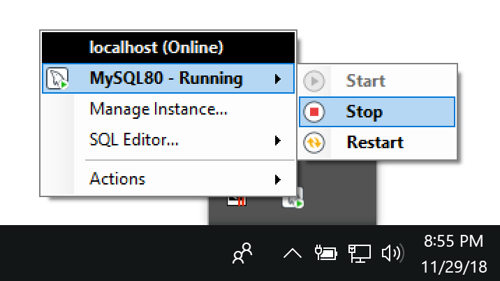

# MySQL: Reading local files (Windows)

A MySQL *.sql script can read text files (e.g., *.csv, *.tsv, *.txt) using the [LOAD DATA INFILE](https://dev.mysql.com/doc/refman/8.0/en/load-data.html) syntax.

### Reading local files
The `LOCAL` keyword is used to load files located on the client host (e.g., your laptop). `LOAD 
DATA LOCAL INFILE <file path> INTO TABLE <table name> . . .` works only if your server and your 
client both have been configured to permit the loading of locally sourced files.

### Example: Populating a table with data from an external file
The two SQL statements below create a `movie` table and a `LOAD DATA LOCAL INFILE` statement
 that inserts into the `movie` table a single column of data from a tab-delimited file named 
 `movie.tsv`.

```mysql
CREATE TABLE IF NOT EXISTS movie
  (
    movie_id INTEGER NOT NULL AUTO_INCREMENT UNIQUE,
    movie_name VARCHAR(100) NOT NULL UNIQUE,
    PRIMARY KEY (movie_id)
  )
ENGINE=InnoDB
CHARACTER SET utf8mb4
COLLATE utf8mb4_0900_ai_ci;

-- Load data from external file.
-- Check for blank entries and set to NULL.
LOAD DATA LOCAL INFILE 'C:/ProgramData/MySQL/MySQL Server 8.0/Uploads/movie.tsv'
INTO TABLE movie
  CHARACTER SET utf8mb4
  FIELDS TERMINATED BY '\t'
  ENCLOSED BY '"'
  LINES TERMINATED BY '\n'
  (movie_name);
```  

### File load error
I expect that you will encounter the following error when attempting to execute a *.sql script 
that includes one or more `LOAD DATA LOCAL INFILE` statements.

```commandline
WARNING: Transaction rollback: (1148, 'The used command is not allowed with this MySQL version')
```

### Add local-infile setting to my.ini
In order to read local files you must add the `local-infile` setting to your `my.ini` file.  

Location: C:\ProgramData\MySQL\MySQL Server 8.0\my.ini

:warning: make a copy of your my.ini before you make changes.

:bulb: I inserted the `local-infile` settings and comments after the following setting:

```commandline
# Secure File Priv.
secure-file-priv="C:/ProgramData/MySQL/MySQL Server 8.0/Uploads"
```

Locate the `secure-file-priv` setting and below it insert the following:

```commandline
# Enable local-infile if LOAD DATA INFILE statements are scoped with the LOCAL keyword.
# See https://dev.mysql.com/doc/refman/8.0/en/load-data.html
# See https://stackoverflow.com/questions/36023339/mysql-python-load-data-local-infile-error
# Values
# 0 disabled
# 1 enabled
local-infile=1
```

### Shutdown/Startup the MySQL Server
In order for the new setting to take effect you *must* stop and then start (or restart) your 
running MySQL 8.0 server. Assuming that you are running MySQL Server as a Windows service you can
 start/stop/restart MySQL in a number of ways:
 
#### NET command (cmd):
Run `cmd` as an administrator and issue the following commands
```commandline
> net stop MySQL80
> net start MySQL80
```

See also the MySQL Reference Manual, Section 2.3.5.6 [Starting MySQL from 
the Windows Command Line](https://dev.mysql.com/doc/refman/8.0/en/windows-start-command-line
.html). 

#### MySQL Workbench
You can also stop/start the MySQL Server from the MySQL Workbench.  Click the "Server" tab and 
then select "Startup/Shutdown."

#### MySQL Notifier 
If you installed [MySQL Notifier](https://www.mysql.com/why-mysql/windows/notifier/) you can 
access it from the System tray located at right side of the Windows task bar. Click the MySQL 
icon (click the "show hidden icons" icon to reveal it) and click the "Stop" button.



### Confirm setting is active
Start the mysql shell and issue the following statement:

```commandline
mysql> SHOW VARIABLES LIKE '%local%';
+---------------+-------+
| Variable_name | Value |
+---------------+-------+
| local_infile  | ON    |
+---------------+-------+
1 row in set (0.00 sec)
```

If the `local_infile` value equals "ON" (or 1) the setting has been activated.  If the setting is
 missing or the value equals "OFF" (or 0) recheck your work and shutdown / startup the MySQL Server again.
 
### File locations
The following rule applies when using the `LOCAL` keyword:

> If LOCAL is specified, the file is read by the client program on the client host and sent to the server. The file can be given as a full path name to specify its exact location. If given as a relative path name, the name is interpreted relative to the directory in which the client program was started.

Note that the default location for files that you need MySQL to read is defined in your `my.ini`:

```commandline
# Secure File Priv.
secure-file-priv="C:/ProgramData/MySQL/MySQL Server 8.0/Uploads"
```

However, as described above you can locate your files elsewhere and use either absolute or 
relative paths as the following example `run_mysql_script.py` output illustrates:

```commandline
(venv) > python run_mysql_script.py -c config/movies.yaml -p input/sql/movies.sql
INFO: Connection created.
INFO: Cursor created.
INFO: Statement executed: 
--
-- Drop tables
-- turn off FK checks temporarily to eliminate drop order issues
--

SET FOREIGN_KEY_CHECKS=0

INFO: Statement executed:
DROP TABLE IF EXISTS movie

INFO: Statement executed:
SET FOREIGN_KEY_CHECKS=1

INFO: Statement executed:

--
-- movies
--

CREATE TABLE IF NOT EXISTS movie
  (
    movie_id INTEGER NOT NULL AUTO_INCREMENT UNIQUE,
    movie_name VARCHAR(100) NOT NULL UNIQUE,
    PRIMARY KEY (movie_id)
  )
ENGINE=InnoDB
CHARACTER SET utf8mb4
COLLATE utf8mb4_0900_ai_ci

INFO: Statement executed:

-- Load data from external file.
-- Check for blank entries and set to NULL.
LOAD DATA LOCAL INFILE 'output/movie.tsv'
INTO TABLE movie
  CHARACTER SET utf8mb4
  FIELDS TERMINATED BY '\t'
  -- FIELDS TERMINATED BY ','
  ENCLOSED BY '"'
  LINES TERMINATED BY '\n'
  -- LINES TERMINATED BY '\r\n'
  -- IGNORE 1 LINES
  (movie_name)

INFO: Changes committed.
INFO: Cursor closed.
INFO: Connection closed.
```

### Table check
Success.

```mysql
mysql> SELECT COUNT(*) FROM movie;
+----------+
| COUNT(*) |
+----------+
|     4917 |
+----------+
1 row in set (0.00 sec)
```